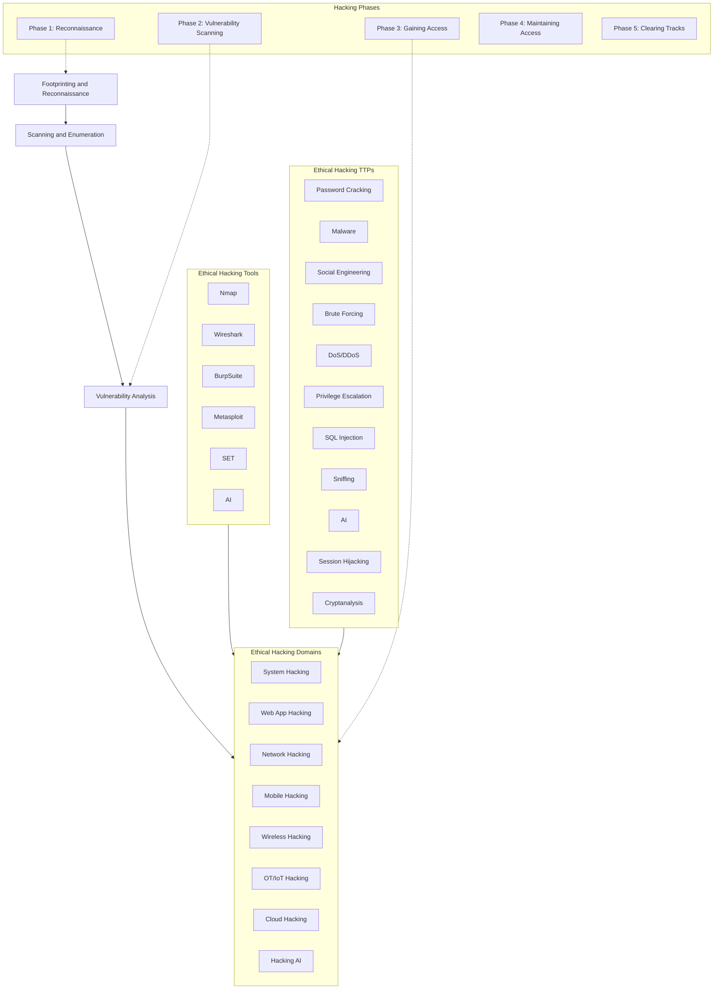
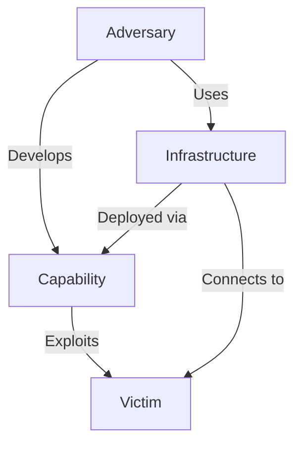
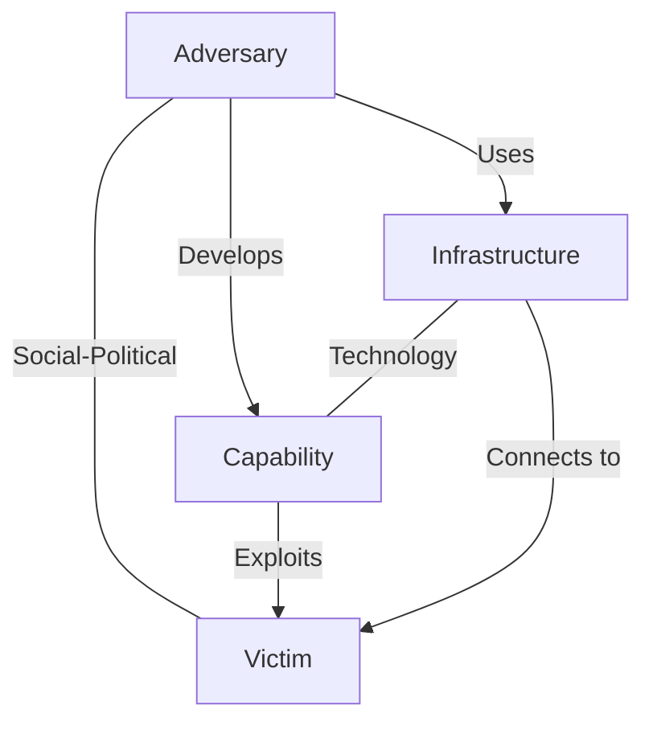

# Hacking Methodologies and Frameworks

Understanding attack phases and threat actor tactics, techniques, and procedures enables proactive defense. Overview of key frameworks such as CEH ethical hacking framework, Cyber Kill Chain, MITRE ATT&CK, Diamond Model of Intrusion Analysis.

## CEH Ethical Hacking Framework

!!! tip "Exam-critical 🎯"

EC-Council's CEH framework defines a step-by-step process that mirrors real-world attacker behavior. The difference between an attacker and an ethical hacker lies solely in **goals and authorization**, not in the methods used.

### The Five Phases

| Phase | Name | Core Activity |
|---|---|---|
| 1 | Reconnaissance | Gather intelligence on the target |
| 2 | Vulnerability Scanning | Identify and classify security weaknesses |
| 3 | Gaining Access | Exploit vulnerabilities to enter the system |
| 4 | Maintaining Access | Retain ownership and escalate control |
| 5 | Clearing Tracks | Erase evidence of compromise |

---

## Phase 1: Reconnaissance

**Goal:** Build a detailed profile of the target before any attack.

- Covers IP ranges, namespaces, employees, websites, Whois data, and organizational structure.
- Target range: clients, employees, operations, network, and systems.

**Passive reconnaissance** — no direct interaction with the target; relies on public information, news releases, and open-source data.

**Active reconnaissance** — direct interaction; uses tools to detect open ports, accessible hosts, router locations, network topology, OSes, and applications.

**Sub-phases within Phase 1:**

- **Scanning** — identifies active hosts, open ports, and unnecessary services using reconnaissance data; involves deeper probing than passive recon (Module 03).
- **Enumeration** — active connections and direct queries to extract user lists, routing tables, shared resources, application banners, and security flaws (Module 04).

---

## Phase 2: Vulnerability Scanning

Examines the ability of systems and applications to withstand attack. Recognizes, measures, and classifies security vulnerabilities across networks, systems, and communication channels. Identified vulnerabilities are used to plan further exploitation (Module 05).

---

## Phase 3: Gaining Access

The phase where **actual hacking occurs**. Attackers use previously gathered intelligence together with techniques such as password cracking and buffer overflow exploitation to gain OS- or application-level access.

- Success depends on: target architecture/configuration, attacker skill level, and initial access level obtained.
- After access, attackers attempt **privilege escalation** to administrator/root level to enable deeper control and lateral movement.

---

## Phase 4: Maintaining Access

Once admin/root access is achieved ("owning" the system), the attacker:

- Uses the system as a **launchpad** for further attacks, or stays low-profile.
- Uploads, downloads, or manipulates data, applications, and configurations.
- Deploys malware to harvest credentials and other stored data.
- **Closes vulnerabilities** to prevent other attackers from disrupting their access.

---

## Phase 5: Clearing Tracks

Attackers erase evidence to remain undetected:

- Modify or delete system logs using log-wiping utilities.
- Remove indicators of compromise to prevent forensic investigation.

The full system hacking process (Phases 3–5) is covered in Module 06: System Hacking.

---

## CEH Framework — Visual Overview

---

## Cyber Kill Chain Methodology

A component of **intelligence-driven defense** developed by Lockheed Martin for the identification and prevention of malicious intrusion activities. Based on the military kill chain concept, it describes **seven sequential phases** of a cyberattack, providing insight into the adversary's TTPs at each stage so defenders can intervene before the attack succeeds.

| # | Phase | Attacker Activity |
|---|---|---|
| 1 | **Reconnaissance** | Gather data on the target to probe for weak points |
| 2 | **Weaponization** | Create a deliverable malicious payload using an exploit and a backdoor |
| 3 | **Delivery** | Send the weaponized bundle to the victim via email, USB, or malicious link |
| 4 | **Exploitation** | Execute code to exploit a vulnerability on the victim's system |
| 5 | **Installation** | Install malware/backdoor on the target system to maintain persistent access |
| 6 | **Command and Control (C2)** | Establish an encrypted two-way channel between victim and attacker-controlled server |
| 7 | **Actions on Objectives** | Perform intended goals: data theft, disruption, or using the system as a launchpad |

### Phase Details

**1. Reconnaissance** — Collects public info (Whois, DNS, social networks, open ports, credentials) to identify weak points and potential entry paths.

**2. Weaponization** — Analyzes recon data to select or create a tailored malware payload (e.g., phishing email with backdoor, exploit kit) targeting identified vulnerabilities.

**3. Delivery** — Transmits the payload via phishing email, USB drive, watering hole attack, or exploit against web applications and servers.

**4. Exploitation** — Triggers malicious code to exploit OS, application, or server vulnerabilities. Threats include arbitrary code execution, auth attacks, and security misconfiguration.

**5. Installation** — Downloads additional malware/backdoors for extended persistence. Uses encryption to hide from security controls; enables lateral spread to other systems.

**6. Command and Control (C2)** — Creates an encrypted two-way channel for remote exploitation, privilege escalation, data exfiltration, and evidence concealment.

**7. Actions on Objectives** — Attacker achieves goals: data theft, service disruption, operational sabotage, or pivoting to further attacks.

---

## Tactics, Techniques, and Procedures (TTPs)

Understanding TTPs allows organizations to stop attacks at the initial stage and build profiles of threat actors for proactive defense.

| Component | Definition | Exam Distinction |
|---|---|---|
| **Tactics** | Overall strategy of a threat actor across all attack phases | Describes *how* an actor operates (info gathering, privilege escalation, persistence, lateral movement) |
| **Techniques** | Specific technical methods used to achieve intermediate results at each stage | Tools, exploits, and misuse of configuration vulnerabilities |
| **Procedures** | Ordered sequence of actions executed to carry out a technique | More actions = higher success rate + lower detection probability |

### Tactics
- Describe the way a threat actor operates **throughout all phases** of an attack.
- APT groups tend to rely on a fixed set of tactics but may adapt to circumstances.
- Organizations can **profile** threat actors based on how they gather info (open-source only vs. social engineering), how they approach targets (individual vs. group), and their C2 infrastructure (static IP vs. dynamically rotating servers).
- Tactics in the **early phases** reveal the attacker's initial profile; tactics in the **final phases** help understand the overall campaign.

### Techniques
- Technical methods used at each stage: initial exploitation, establishing C2, privilege escalation, lateral movement, data exfiltration, covering tracks.
- Non-technical methods (e.g., social engineering, phone-based credential theft) also qualify as techniques.
- In the **final stages**, techniques are often purely technical — encrypted file transfer over C2, log-clearing via automated tools.
- Aggregating techniques across all stages enables accurate threat actor attribution.

### Procedures
- A sequence of ordered actions to execute a step of the attack lifecycle.
- Advanced threat actors use **more actions** within a procedure to increase success rate and evade detection (e.g., malware that decrypts itself, evades monitoring, deploys persistence, and opens C2 — all as one procedure).
- Procedures are common across different threat actors for the same malware feature, making them useful in **forensic investigations**.
- Early-stage procedures (info gathering) are hard to observe; later-stage procedures leave trails for analysis.

---

## Adversary Behavioral Identification

Identifying common attacker methods after initial access gives defenders insight into upcoming threats and enables proactive hardening.

| Behavior | What the Adversary Does | Detection Method |
|---|---|---|
| **Internal Reconnaissance** | Enumerates systems, users, processes, IPs after gaining access | Unusual Batch/PowerShell commands; packet capture |
| **Use of PowerShell** | Automates data exfiltration and lateral attacks | PowerShell transcript logs, Windows Event logs |
| **Unspecified Proxy Activities** | Multiple domains pointing to same host to switch and evade detection | Check data feeds from suspicious domains |
| **Use of Command-Line Interface** | Browses files, modifies content, creates accounts, downloads malware | Process logs for arbitrary IDs and malicious downloads |
| **HTTP User Agent** | Modifies user-agent field to communicate with compromised systems | Inspect user-agent field content in traffic logs |
| **Command and Control Server** | Encrypted session to control compromised systems remotely | Track outbound connections, unusual open ports, anomalies |
| **Use of DNS Tunneling** | Hides malicious traffic in legitimate DNS; bypasses controls | Analyze DNS request patterns, payloads, and destinations |
| **Use of Web Shell** | Installs shell in website for remote server access and file transfers | Server access/error logs, suspicious strings, user-agent strings |
| **Data Staging** | Aggregates sensitive data before exfiltration or destruction | Monitor file transfers, file integrity changes, event logs |

---

## Indicators of Compromise (IoCs)

**IoCs** are clues, artifacts, and forensic data found on a network or OS that indicate a potential intrusion or malicious activity. IoCs are not intelligence themselves — they are data points that feed the intelligence process.

### IoC Types

| Type | Description | Examples |
|---|---|---|
| **Atomic** | Cannot be broken into smaller parts; meaning unchanged in intrusion context | IP addresses, email addresses |
| **Computed** | Derived from data extracted during a security incident | Hash values, regular expressions |
| **Behavioral** | Combination of atomic + computed indicators grouped by logic | Code injection pattern, script execution chain |

### IoC Categories

| Category | Description | Examples |
|---|---|---|
| **Email** | Malicious data delivered via socially engineered emails | Sender address, subject line, attachments/links |
| **Network** | Useful for C2 identification, malware delivery, OS/browser fingerprinting | URLs, domain names, IP addresses |
| **Host-Based** | Found by analyzing infected systems within the network | Filenames, file hashes, registry keys, DLLs, mutex |
| **Behavioral** | Identifies specific malicious behaviors rather than static signatures | PowerShell script from document, remote command execution |

### Key IoC Signals

- Unusual outbound network traffic
- Unusual activity through a privileged user account
- Geographical anomalies
- Multiple login failures
- Increased database read volume
- Large HTML response size
- Multiple requests for the same file
- Mismatched port-application traffic
- Suspicious registry or system file changes
- Unusual DNS requests
- Unexpected patching of systems
- Signs of DDoS activity
- Bundles of data in wrong places
- Web traffic with superhuman behavior

---

## MITRE ATT&CK Framework

**MITRE ATT&CK** (Adversarial Tactics, Techniques, and Common Knowledge) is a **globally accessible knowledge base of adversary tactics and techniques** based on real-world observations. It serves as the foundation for developing threat models and methodologies across the private sector, government, and the cybersecurity product and service community.

### Collections and Structure

MITRE ATT&CK comprises **three collections**, each represented in a matrix form:

| Collection | Scope | Coverage |
|---|---|---|
| **PRE-ATT&CK** | Pre-intrusion activities | Reconnaissance, Resource Development, Delivery |
| **ATT&CK for Enterprise** | Post-compromise activities | 14 tactics covering initial access through impact |
| **Mobile** | Mobile-specific tactics and techniques | iOS and Android environments |

The **14 tactic categories in ATT&CK for Enterprise** are derived from the **later stages** (exploit, control, maintain, execute) of the seven-stage **Cyber Kill Chain**, providing finer granularity in describing intrusion activities.

### The 14 Enterprise ATT&CK Tactics

| Tactic | Definition |
|---|---|
| **Reconnaissance** | Gather information on targets via public sources and active probing |
| **Resource Development** | Acquire tools, infrastructure, and credentials needed for the attack campaign |
| **Initial Access** | Establish foothold on the target network |
| **Execution** | Execute code or commands on the target system |
| **Persistence** | Maintain presence in the target environment |
| **Privilege Escalation** | Escalate access to higher privileges |
| **Defense Evasion** | Evade security controls and monitoring |
| **Credential Access** | Extract valid credentials from systems or users |
| **Discovery** | Map the internal environment and systems |
| **Lateral Movement** | Move across the network to additional systems |
| **Collection** | Gather data of interest from systems or networks |
| **Command and Control** | Establish encrypted channels for remote control |
| **Exfiltration** | Extract stolen data from the environment |
| **Impact** | Disrupt or destroy systems and data |

### PRE-ATT&CK vs. Enterprise ATT&CK Mapping to Cyber Kill Chain

| Kill Chain Phase | ATT&CK Framework | Enterprise Tactics |
|---|---|---|
| **Recon** | PRE-ATT&CK | Reconnaissance |
| **Weaponize** | PRE-ATT&CK | Resource Development |
| **Deliver** | Enterprise ATT&CK | Initial Access |
| **Exploit** | Enterprise ATT&CK | Execution, Privilege Escalation, Defense Evasion |
| **Control** | Enterprise ATT&CK | Command and Control |
| **Execute** | Enterprise ATT&CK | Persistence, Credential Access, Discovery |
| **Maintain** | Enterprise ATT&CK | Lateral Movement, Collection, Exfiltration, Impact |

### Use Cases of MITRE ATT&CK

- **Prioritize** development and acquisition efforts for computer network defense capabilities
- **Conduct analyses** of alternatives between network defense capabilities
- **Determine coverage** of a set of network defense capabilities against known threats
- **Describe intrusion chains** of events based on techniques used, with a common reference
- **Identify commonalities** between adversary tradecraft and distinguish threat actors
- **Connect** mitigations, weaknesses, and adversaries for holistic threat understanding

---

## Diamond Model of Intrusion Analysis

Developed by expert analysts, the Diamond Model provides a framework for **identifying clusters of events** correlated across an organization's systems. Each intrusion is represented as a **Diamond event** — the vital atomic element of any intrusion activity — consisting of four core features arranged in a diamond shape.

Key benefits:
- Connect events as activity threads to understand *how* and *what* transpired
- Identify missing data by examining absent features
- Develop advanced mitigation approaches and increase analytic efficiency
- Raises cost for the adversary while reducing cost for the defender

### The Four Core Features

| Feature | Key Question | Description |
|---|---|---|
| **Adversary** | *Who* | The opponent/hacker responsible for the attack. Exploits a capability against the victim for financial gain or reputational damage. Can be an insider, individual, or competitor organization. |
| **Victim** | *Where* | The target exploited or environment where the attack occurred. Can be a person, organization, or network asset (IP, domain, email address). |
| **Capability** | *How* | All strategies, methods, and procedures used in the attack — including malware, tools, and techniques (e.g., brute force, ransomware). |
| **Infrastructure** | *What* | Hardware or software used by the adversary to reach the victim (e.g., email server exploited to target employees). Exploitation leads to data leakage and exfiltration. |

### Additional Event Meta-Features

Meta-features provide additional context that links related events, enabling faster and more accurate attack tracing.

| Meta-Feature | Description |
|---|---|
| **Timestamp** | Time and date of an event; reveals the beginning, end, and periodicity of an attack. |
| **Phase** | Progress of the attack (maps to Kill Chain phases: recon, weaponization, delivery, exploitation, etc.). |
| **Result** | Outcome: success, failure, or unknown. Can also be classified as CIA compromised (confidentiality, integrity, availability). |
| **Direction** | How the adversary was routed to the victim: victim↔infrastructure, adversary↔infrastructure, infrastructure↔infrastructure, or bidirectional. |
| **Methodology** | Overall class of action (e.g., spear-phishing, DDoS, content delivery attack, drive-by-compromise). |
| **Resource** | External resources used: hardware, software, access, knowledge, or data. |

### Extended Diamond Model

The Extended Diamond Model adds two meta-features to the four core features:

| Meta-Feature | Axis | Description |
|---|---|---|
| **Socio-Political** | Adversary ↔ Victim | Describes the relationship and motivation between attacker and target (financial gain, espionage, hacktivism). |
| **Technology** | Infrastructure ↔ Capability | Describes how technology enables communication and operation; used to identify malicious activity in an organization's tech stack. |

