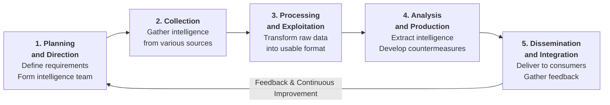
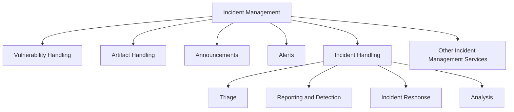
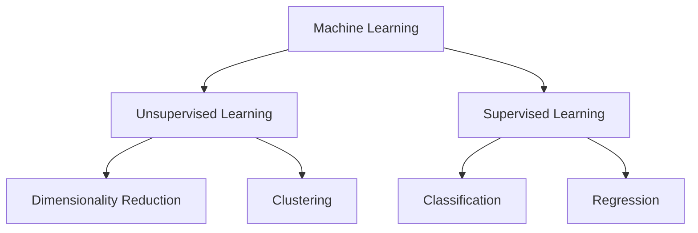

# Information Security Controls

Information security controls prevent unwanted events and reduce organizational risk through policies, awareness, and security mechanisms. Overview of Information Assurance, continual security strategy, defense-in-depth, risk management, cyber threat intelligence, threat modeling, incident management, and AI/ML concepts.

## Information Security Controls Overview

Information security controls prevent unwanted events and reduce risk to organizational information assets. Security controls include physical, technical, and administrative measures that protect the confidentiality, integrity, availability, authenticity, and non-repudiation of information during usage, processing, storage, and transmission.

Controls are enforced through policies, awareness training, security mechanisms, and risk management strategies. The ultimate goal is to ensure information assurance — that only authorized personnel access and use information while maintaining business continuity.

## Information Assurance (IA)

Information Assurance refers to the assurance of the integrity, availability, confidentiality, and authenticity of information and information systems. Information Assurance and Information Risk Management (IRM) ensure that only authorized personnel can access and use information, achieving information security and business continuity.

### Eight Key IA Processes

| # | Process | Explanation |
|---|---------|-------------|
| 1 | Develop local policy, process, and guidance | Establish policies and procedures to maintain information systems at optimum security levels. |
| 2 | Design network and user authentication strategies | Implement secure network infrastructure and robust user authentication to protect privacy and system data. |
| 3 | Identify network vulnerabilities and threats | Conduct vulnerability assessments to understand security posture and identify areas requiring countermeasures. |
| 4 | Identify problems and resource requirements | Determine gaps in current security controls and define what resources are needed to address them. |
| 5 | Create plans for identified resource requirements | Allocate resources and establish priorities for security investments and improvements. |
| 6 | Apply appropriate information assurance controls | Implement physical, technical, and administrative controls tailored to identified risks and requirements. |
| 7 | Perform Certification and Accreditation (C&A) | Validate that systems meet security standards, identify remaining vulnerabilities, and implement remediation measures. |
| 8 | Provide information assurance training | Build organizational awareness and IT security knowledge across federal and private sector personnel. |

## Continual/Adaptive Security Strategy

Adaptive security strategy prescribes continuous **Predict**, **Protect**, **Detect**, and **Respond** actions to ensure comprehensive computer network defense. This cyclical approach enables organizations to anticipate threats, prevent compromise, identify intrusions, and remediate incidents in real time.

| Pillar | Activities | Focus |
|--------|-----------|-------|
| **Predict** | Risk and vulnerability assessments, attack surface analysis, threat intelligence consumption | Identify potential attacks, targets, and methods before they materialize into viable threats. |
| **Protect** | Security policies, physical security, host security, firewalls, Intrusion Detection Systems (IDS) | Eliminate vulnerabilities and deploy prior countermeasures to prevent unauthorized access and compromise. |
| **Detect** | Network monitoring, packet sniffing, traffic analysis, anomaly detection | Assess the network for abnormalities (attacks, unauthorized access, unauthorized modifications) and locate them. |
| **Respond** | Incident response, investigation, containment, eradication, impact mitigation | Identify incidents, determine root causes, decide if incident is real or false positive, and execute remediation actions. |

## Defense-in-Depth

Defense-in-depth is a security strategy in which multiple **protection layers** are placed throughout an information system. It applies the military principle that a complex, multi-layered defense system is more difficult to defeat than a single barrier.

### Key Benefits

- **Prevents direct attacks** — A break in one layer only leads the attacker to the next protective layer.
- **Minimizes impact** — If an attacker gains access to one layer, defense-in-depth limits the scope and severity of damage.
- **Provides time for response** — Layered defenses give administrators and engineers time to deploy new or updated countermeasures before intrusion spreads.

### Layers of Defense

Defense-in-depth typically includes multiple layers spanning administrative, technical, and physical domains:

| Layer | Controls & Measures |
|-------|-------------------|
| **Policies, Procedures, and Awareness** | Organizational security guidelines and user training |
| **Physical Security** | Access controls, CCTV, locks, environmental controls |
| **Perimeter Security** | Firewalls, boundary protection, network segmentation |
| **Internal Network** | Intrusion Detection/Prevention Systems (IDS/IPS), network monitoring, access controls |
| **Host Security** | Operating System (OS) hardening, antivirus, host-based firewalls, patch management |
| **Application Security** | Secure coding, input validation, authentication/authorization |
| **Data Security** | Encryption, data classification, access controls, backup and recovery |

## Risk Management

### What is Risk?

Risk refers to the degree of **uncertainty or expectation** that an adverse event may cause damage to the system or its resources. It is the combination of the **probability of a threat** occurring and the **consequence or impact** of that event.

**Risk Formula:**

$$\text{Risk} = \text{Threat} \times \text{Vulnerability} \times \text{Impact}$$

Or alternatively:

$$\text{Risk} = \text{Threat} \times \text{Vulnerability} \times \text{Asset Value}$$

Risk can be expressed as:

$$\text{Risk} = \text{Threat} \times \text{Vulnerability} \times \text{Impact}$$

### Risk Levels

Risks are categorized into different levels according to their estimated impact on the system. Organizations use risk levels to prioritize remediation efforts.

The level of risk is calculated using:

$$\text{Level of Risk} = \text{Consequence} \times \text{Likelihood}$$

| Risk Level | Consequence | Action |
|-----------|------------|--------|
| **Extreme or High** | Serious or Imminent danger | • Immediate measures required to combat risk • Identify and impose controls to reduce risk to a reasonably low level |
| **Medium** | Moderate danger | • Immediate action not required, but action should be implemented quickly • Implement controls as soon as possible to reduce risk to a reasonably low level |
| **Low** | Negligible danger | • Take preventive steps to mitigate the effects of risk |

### Risk Matrix

The risk matrix is a graphical representation that scales **likelihood (probability)** against **consequences (impact)** to visualize and compare risks. It helps in decision-making and risk prioritization.

| Probability | Likelihood | Insignificant | Minor | Moderate | Major | Severe |
|-------------|-----------|---------------|-------|----------|-------|--------|
| 81 - 100% | Very High Probability | Low | Medium | High | Extreme | Extreme |
| 61 - 80% | High Probability | Low | Medium | High | High | Extreme |
| 41 - 60% | Equal Probability | Low | Medium | Medium | High | High |
| 21 - 40% | Low Probability | Low | Low | Medium | Medium | High |
| 1 - 20% | Very Low Probability | Low | Low | Medium | Medium | High |

**Note:** This is an example risk matrix. Organizations must create their own risk matrices based on their business needs and risk appetite.

### Key Risk Concepts

- **Likelihood (Probability):** The chance that a risk event will occur
- **Consequence (Impact):** The severity or extent of damage if a risk event occurs
- **Control Measures:** May decrease the level of risk, but do not always entirely eliminate it

## Risk Management Process

Risk management is the process of **reducing and maintaining risk at an acceptable level** by means of a well-defined and actively employed security program. It is a continuous and complex process that helps organizations identify, assess, respond to, and control potential effects of risk throughout all stages of operations.

### Risk Management Objectives

| Objective | Description |
|-----------|-------------|
| **Identify potential risks** | The main objective; identify sources, causes, and consequences of internal and external risks affecting organizational security |
| **Assess risk impact** | Develop better risk management strategies and plans based on estimated likelihood and consequences |
| **Prioritize risks** | Rank identified risks by severity and impact using established risk management methods and tools |
| **Understand and analyze risks** | Report identified risk events with thorough analysis and documentation |
| **Control and mitigate** | Reduce risk effects and consequences through appropriate countermeasures and controls |
| **Create awareness** | Develop strategies and build lasting risk management culture among security staff and personnel |

### Risk Management Phases

| Phase | Description | Key Activities |
|-------|-------------|-----------------|
| **Risk Identification** | Initial step to identify sources, causes, and consequences of internal and external risks before they cause harm | • Identify risks affecting organization security • Depends on skill set and differs by organization |
| **Risk Assessment** | • Assess organization's risks and estimate likelihood and impact • Ongoing iterative process | • Assign priorities for mitigation • Determine quantitative/qualitative value • Detect and prioritize risks |
| **Risk Treatment** | Select and implement appropriate controls to modify identified risks based on severity level | • Identify treatment methods • Determine responsibility, costs, benefits • Prioritize order of treatment |
| **Risk Tracking** | Continuous monitoring and observation of implemented controls and risk status | • Monitor control effectiveness • Track risk indicators • Maintain risk registers • Observe for emerging risks |
| **Risk Review** | Periodic evaluation and assessment of risk management strategies and control effectiveness | • Review control performance • Verify procedures are understood and followed • Identify improvement opportunities |

### Risk Treatment Considerations

Before treating a risk, organizations must determine:
- The appropriate method of treatment
- People responsible for implementation
- Costs and benefits involved
- Likelihood of success
- Ways to measure and assess treatment effectiveness

## Cyber Threat Intelligence

**Threat:** A potential occurrence of an undesired event that can damage and interrupt organizational operational and functional activities, affecting integrity and availability of systems and assets.

**Cyber Threat Intelligence (CTI):** The collection and analysis of information about threats and adversaries, including patterns that enable knowledgeable decisions for preparedness, prevention, and response actions against cyber attacks. CTI converts unknown threats into known threats through research and analysis of emerging cyber threats, trends, and technical developments.

### Purpose and Benefits

CTI helps organizations:
- **Identify and mitigate** various business risks by converting unknown threats into known threats
- **Develop proactive cybersecurity posture** in advance of exploitation
- **Anticipate attacks** before they occur, resulting in better and more secure systems
- **Handle threats effectively** with proper planning and execution
- **Strengthen defense systems** and create awareness about impending risks
- **Respond promptly** with appropriate countermeasures

CTI identifies risk factors responsible for malware, SQL injections, web application attacks, data leaks, phishing, and denial-of-service attacks.

### Types of Threat Intelligence

Threat intelligence is subdivided into four types based on **consumers** and **goals**. They differ in data collection, analysis, and consumption.

| Type | Definition | Consumers | Key Focus |
|------|-----------|-----------|-----------|
| **Strategic** | High-level information on cybersecurity posture, threats, financial impact, and attack trends | High-level executives, IT management, Chief Information Security Officer (CISO) | Long-term issues, business strategies, high-level concepts |
| **Tactical** | Information on tactics, techniques, and procedures (TTPs) used by threat actors | IT service managers, security managers, Network Operations Center (NOC) staff, administrators | Adversary attack methods, detection and mitigation strategies |
| **Operational** | Information about specific threats with contextual details on security events and incidents | Security managers, heads of incident response, network defenders, forensics teams | Threat actor intentions and capabilities, early-stage attack detection |
| **Technical** | Information about resources (tools, command and control channels) attackers use, focused on Indicators of Compromise (IoCs) | Security Operations Center (SOC) staff, incident response teams | Specific technical implementations, rapid response to threats |

### Strategic Threat Intelligence

**Information includes:**
- Financial impact of cyber activity
- Attribution for intrusions and data breaches
- Threat actors and attack trends
- Threat landscape for industry sectors
- Statistical information on breaches and malware
- Geopolitical conflicts involving cyber attacks
- Changes in adversary tactics, techniques, and procedures (TTPs) over time

**Sources:** Open Source Intelligence (OSINT), CTI vendors, Information Sharing and Analysis Organizations (ISAOs), Information Sharing and Analysis Centers (ISACs); requires highly skilled professionals

### Tactical Threat Intelligence

**Activities:**
- Develop detection and mitigation strategies
- Update security products with identified indicators
- Patch vulnerable systems
- Analyze security incidents and events

**Sources:** Campaign reports, malware samples, incident reports, attack group reports, human intelligence, white papers, technical papers, third-party intelligence

### Operational Threat Intelligence

**Activities:**
- Identify past malicious activities
- Perform efficient investigations
- Deploy security assets to identify and stop upcoming attacks
- Reduce damage to IT assets

**Sources:** Human intelligence, social media, chat rooms, real-world activities and events; typically collected by government organizations

### Technical Threat Intelligence

**Examples:**
- Specific malware implementations
- IP addresses and domains used by malicious endpoints
- Phishing email headers
- Hash checksums of malware

**Application:** Added to defensive systems (Intrusion Detection/Prevention Systems (IDS/IPS), firewalls, endpoint security) to enhance detection mechanisms and identify malicious traffic at early stages

## Threat Intelligence Lifecycle

The threat intelligence lifecycle is a continuous process of developing intelligence from raw data that supports organizations in developing defensive mechanisms to thwart emerging risks and threats. Higher-level executives provide continuous support to the intelligence team by evaluating and giving feedback at every stage. The lifecycle consists of five phases: planning and direction, collection, processing and exploitation, analysis and production, and dissemination and integration.

### Phase 1: Planning and Direction

**Purpose:** Develop a proper plan based on strategic intelligence requirements and define the entire intelligence program.

**Key Activities:**
- Define intelligence requirements (what information is needed, which data should be prioritized)
- Make a collection plan
- Identify data collection methods and requirements
- Form an intelligence team with defined roles and responsibilities
- Send requests for data collection from various internal and external sources
- Set planning and requirements for later cycle phases

**Objectives:**
- Establish effective and genuine intelligence data gathering using available resources
- Ensure intelligence program supports organizational strategic needs
- Provide foundation for complete intelligence process from collection to final delivery

### Phase 2: Collection

**Purpose:** Gather desired intelligence from multiple sources using technical and human means.

**Collection Methods:**
- **Human Intelligence (HUMINT):** Data collected from human sources
- **Imagery Intelligence (IMINT):** Data collected through visual reconnaissance
- **Measurement and Signature Intelligence (MASINT):** Data collected through technical measurements and signatures
- **Signal Intelligence (SIGINT):** Data collected through interception of signals
- **Open Source Intelligence (OSINT):** Data collected from publicly available sources
- **Indicators of Compromise (IoCs):** Technical indicators of malicious activity
- **Third-party sources:** External intelligence providers and data feeds

**Data Collection Sources:**
- Critical applications and network infrastructure
- Security infrastructure and systems
- Internal and external data sources (direct or covert)

**Outcome:** Collected data transferred for processing in next phase

### Phase 3: Processing and Exploitation

**Purpose:** Transform raw data into meaningful, usable information.

**Key Activities:**
- Process raw data for exploitation
- Convert raw data into useful information using sophisticated technology and tools
- Interpret data using highly trained professionals
- Convert interpreted data into usable format for analysis phase

**Automated Processing Functions:**
- Data structuring, decryption, language translation
- Parsing, data reduction, filtering
- Data correlation and aggregation

**Requirements for Effective Processing:**
- Proper understanding of data collection plan
- Knowledge of consumer requirements
- Clear analytical strategy
- Understanding of data types being processed

### Phase 4: Analysis and Production

**Purpose:** Analyze processed intelligence to extract refined information and identify threats.

**Analysis Components:**
- Facts, findings, and forecasts that enable estimation and anticipation of attacks
- Combination of information from various sources into single entity
- Application of analysis techniques: qualitative, quantitative, machine-based, statistical methods

**Analysis Characteristics (must be):**
- **Objective:** Unbiased and based on evidence
- **Timely:** Delivered when needed
- **Accurate:** Correct and verified
- **Actionable:** Can be directly used for decision-making

**Reasoning Techniques:**
- Deduction (general to specific)
- Induction (specific to general)
- Abduction (best explanation)
- Scientific method (confidence-based analysis)

**Outcome:** Elevated raw data to intelligence when sufficient context exists for identifying threats; development of appropriate countermeasures

### Phase 5: Dissemination and Integration

**Purpose:** Deliver analyzed intelligence to intended consumers and gather feedback for continuous improvement.

**Dissemination Methods:**
- Automated means (digital feeds, dashboards)
- Manual methods (reports, briefings, presentations)

**Major Intelligence Information Types for Distribution:**
- Threat indicators and Indicators of Compromise (IoCs)
- Adversary Tactics, Techniques, and Procedures (TTPs)
- Security alerts
- Threat intelligence reports
- Tool configuration information

**Intelligence Consumption by Level:**
- **Strategic Level:** High-level executives and management; focus on business strategies and risk-based decisions
- **Tactical Level:** IT service and Security Operations Center (SOC) managers, administrators, architects; focus on adversary TTPs
- **Operational Level:** Security managers and network defenders; focus on specific threats to organization
- **Technical Level:** SOC staff and Incident Response (IR) teams; focus on identified Indicators of Compromise (IoCs)

**Benefits of Dissemination:**
- Helps organizations build defensive and mitigation strategies
- Internal sharing builds situational awareness
- External sharing enhances industry security posture
- Improves risk management processes

**Feedback Loop:**
- Consumers provide assessment on intelligence relevance and accuracy
- Feedback describes whether extracted intelligence meets consumer requirements
- Continuous cycle improves intelligence accuracy through relevant and timely assessments
- Cycle repeats with refined requirements and methods

## Threat Modeling

**Threat Modeling:** A risk assessment approach for analyzing the security of an application by capturing, organizing, and analyzing all the information that affects it. Every application should have a developed and documented threat model that should be revisited as the application evolves and development progresses.

### Purpose and Benefits

Threat modeling helps to:
- **Identify relevant threats** to a particular application scenario
- **Identify key vulnerabilities** in an application's design
- **Improve security design** through comprehensive threat analysis
- Determine security objectives and constraints
- Guide security efforts by understanding the application architecture and data flows

### Key Principles and Best Practices

**Focus on Approach, Not Rigidity:**
- Do not be rigid about specific steps or implementations
- If any step becomes impassable, proceed to step 4 and identify the problem
- Use iterative approach and add details as design and development continue

**Use Existing Resources:**
- Use documented use cases, architectural diagrams, and data flow diagrams
- Start with a whiteboard before capturing information in documents
- Obtain input from system and network administrators about host/network constraints
- Use scenarios to scope modeling activities

**Information to Gather:**
- Host configurations and firewall policies
- Allowed protocols and ports
- End-to-end deployment details
- Role-based access controls
- Technology stack and components

### Threat Modeling Process (5 Steps)

| Step | Process | Description |
|------|---------|-------------|
| **1** | **Identify Security Objectives** | Define goals and constraints related to confidentiality, integrity, and availability • What data should be protected? • Are there compliance requirements? • What are quality-of-service requirements? • What intangible assets need protection? |
| **2** | **Application Overview** | Understand the application structure and architecture • Identify components, data flows, trust boundaries • Draw end-to-end deployment topology • Identify logical layers, key services, communication protocols • Identify roles, usage scenarios, technologies, security mechanisms |
| **3** | **Decompose the Application** | Break down application to identify trust boundaries and data flows • Identify trust boundaries (where trust levels change) • Identify data flows from entry to exit • Identify entry points (methods for intrusion) • Identify exit points (data transfer to clients/external systems) |
| **4** | **Identify Threats** | Find relevant threats to control scenario and context • Use common threats grouped by vulnerability category • Bring development and test teams together • Use question-driven approach based on application overview and decomposition |
| **5** | **Identify Vulnerabilities** | Find weaknesses that allow attacker exploitation • Identify weaknesses related to threats found • Use vulnerability categories for identification • Fix vulnerabilities beforehand to prevent breaches |

### Application Overview Components

When identifying application overview, include:

**Deployment Diagram Elements:**
- End-to-end deployment topology
- Logical layers
- Key components and services
- Communication ports and protocols
- Identities and external dependencies

**Role Identification:**
- Higher-privileged user groups
- Read, update, and delete permissions
- Role-based access controls

**Technology Stack:**
- Operating systems
- Web server and database server software
- Presentation, business, and data access layers
- Development languages

**Security Mechanisms:**
- Input and data validation
- Authorization and authentication
- Sensitive data handling
- Configuration management
- Session management
- Parameter manipulation
- Cryptography implementation
- Exception management
- Auditing and logging

### Decomposition Details

**Trust Boundaries:**
- Outer system boundaries
- Access control points requiring extra privileges
- Trust boundaries from data flow perspective

**Data Flows:**
- Input from entry to exit
- Communication with external systems and clients
- Internal component interactions
- Data validation at trust boundary entry points

**Entry Points:**
- User interaction points (attack vectors)
- Internal entry points for component communication
- Critical functionalities requiring adequate defense

**Exit Points:**
- Data transfer to clients or external systems
- Priority on points writing untrusted data or client input
- Shared database connections

## Incident Management

**Incident Management:** A set of defined processes to **identify, analyze, prioritize, and resolve** security incidents to restore normal service operations as quickly as possible and prevent future recurrence. It involves responding to security events, triggering alerts to prevent potential risks and threats, and proactively identifying vulnerabilities before exploitation.

### What Incident Management Involves

Incident management encompasses multiple activities and functions:

- **Vulnerability Analysis** — Identifying software and systems open to attacks before exploitation
- **Artifact Analysis** — Examining forensic evidence and artifacts from security incidents
- **Security Awareness Training** — Conducting training sessions to help users recognize suspicious events and report incidents
- **Intrusion Detection** — Monitoring and identifying unauthorized access attempts and compromises
- **Public/Technology Monitoring** — Tracking security announcements, alerts, and technology trends

### Incident Management Process Objectives

The incident management process is designed to achieve the following goals:

- **Improve service quality** and system performance
- **Resolve problems proactively** before they escalate
- **Reduce the impact** of incidents on the organization or its business operations
- **Meet service availability requirements** and maintain business continuity
- **Increase staff efficiency and productivity** by streamlining response processes
- **Improve user and customer satisfaction** through faster resolution
- **Assist in handling future incidents** through lessons learned and documentation

### Organizational Roles in Incident Management

Different organizational functions play critical roles in incident management:

| Role | Responsibilities |
|------|-----------------|
| **Human Resources (HR)** | Take steps to terminate employees suspected of harmful computer activities or security violations |
| **Legal Counsel** | Set rules and regulations for the organization; influence internal security policies and practices; provide guidance on compliance and legal implications of incidents |
| **Firewall Manager** | Maintain and manage firewall filters; monitor for denial-of-service (DoS) attacks and suspicious traffic patterns |
| **Outsourced Service Provider** | Repair and remediate systems infected by viruses, malware, and other security threats; provide technical recovery services |

### Incident Management Structure and Hierarchy

### Incident Response, Incident Handling, and Incident Management Relationship

| Concept | Definition | Relationship |
|---------|-----------|--------------|
| **Incident Response** | Actions to respond to and contain identified security incidents | One of the functions performed in incident handling |
| **Incident Handling** | Services that encompass detection, reporting, response, and analysis of incidents | One of the services provided as part of incident management |
| **Incident Management** | Comprehensive set of processes to identify, analyze, prioritize, and resolve security incidents | Overarching framework that includes incident handling |

## Incident Handling and Response

**Incident Handling and Response (IH&R):** The process of taking organized and careful steps when reacting to a security incident or cyberattack. It is a set of procedures, actions, and measures taken against an unexpected event. IH&R involves logging, recording, and resolving incidents while noting when they occurred, their impact, and their cause.

### Purpose and Scope

IH&R is the practice of managing incident response processes — such as preparation, detection, containment, eradication, and recovery — to overcome incident impact quickly and efficiently. The IH&R process provides a focused approach for restoring normal business operations as quickly as possible after an incident with minimal impact on the business. It includes defining user policies, developing protocols, building incident response teams, auditing organizational assets, planning response procedures, obtaining management approval, incident reporting, prioritization, and managing response. It also establishes proper communication between responders and guides them to detect, analyze, contain, recover, and prevent incidents.

### The Nine Steps of IH&R

| Step | Phase | Description |
|------|-------|-------------|
| **1** | **Preparation** | Audit resources and assets to determine security purpose. Define rules, policies, and procedures for the IH&R process. Build and train incident response teams. Define incident readiness procedures. Gather required tools and train employees on system and account security. |
| **2** | **Incident Recording and Assignment** | Initial reporting and recording of the incident takes place. Identify the incident and define proper incident communication plans for employees. Include communication methods for informing IT support personnel or submitting appropriate tickets. |
| **3** | **Incident Triage** | Analyze, validate, categorize, and prioritize identified security incidents. Analyze the compromised device to find incident details: type of attack, severity, target, impact, propagation method, and vulnerabilities exploited. |
| **4** | **Notification** | IH&R team informs various stakeholders — including management, third-party vendors, and clients — about the identified incident. |
| **5** | **Containment** | Prevent spread of infection to other organizational assets. Stop additional damage and limit the incident's scope. |
| **6** | **Evidence Gathering and Forensic Analysis** | Accumulate all possible evidence related to the incident. Submit evidence to forensic department for investigation. Forensic analysis reveals attack method, exploited vulnerabilities, averted security mechanisms, infected network devices, and compromised applications. |
| **7** | **Eradication** | Remove or eliminate the root cause of the incident. Close all attack vectors to prevent similar incidents in the future. |
| **8** | **Recovery** | Restore affected systems, services, resources, and data after eliminating incident causes. Ensure the incident causes no disruption to organizational services or business. |
| **9** | **Post-Incident Activities** | Conduct final review and analysis before closing the matter. Include: incident documentation, incident impact assessment, and reviewing and revising policies. |

## Role of AI and ML in Cyber Security

Machine learning (ML) and Artificial Intelligence (AI) are now widely used across various industries due to **increased computing power, data collection, and storage capabilities**. In cybersecurity, AI and ML help **identify new exploits and weaknesses** that can be analyzed to mitigate further attacks, reducing pressure on security professionals and providing real-time alerts.

### What are AI and ML?

**Artificial Intelligence (AI)** is a solution to defend networks against attacks that traditional antivirus scans cannot detect. Large amounts of collected data are fed into AI systems, which process and analyze it to understand patterns, details, and trends.

**Machine Learning (ML)** is a branch of artificial intelligence (AI) that enables systems to **self-learn without explicit programming**. This self-learning capability allows systems to define what normal network behavior and device operations look like, then identify and report deviations or anomalies in real-time.

### ML Classification Techniques

Machine learning uses two primary classification approaches:

#### Supervised Learning

**Definition:** Uses algorithms that input a **set of labeled training data** to learn the differences between given labels.

**Subcategories:**
- **Classification** — Data is completely divided into classes; the main task is to define the test sample and identify its class
- **Regression** — Used when data classes are not separated (continuous data where values are not divided into distinct categories)

#### Unsupervised Learning

**Definition:** Uses algorithms that input **unlabeled training data** to deduce all categories without guidance.

**Subcategories:**
- **Clustering** — Divides data into clusters based on similarities, regardless of class information
- **Dimensionality Reduction** — The process of reducing the number of dimensions (attributes) in data while preserving relevant information

### How Do AI and ML Prevent Cyber Attacks?

AI and ML are widely adopted by large-scale industries such as automation, IT services, manufacturing, production, and finance. AI plays a crucial role in detecting imminent cyber threats by incorporating machine learning as a subset. The following table describes how AI and ML safeguard organizations from cybersecurity attacks:

| # | Method | Description |
|---|--------|-------------|
| **1** | **Password Protection and Authentication** | AI improves biometric validations and face recognition to prevent credential breaches. AI provides the latest models for recognizing individual faces by tracking key correlations and patterns, enhancing authentication security. |
| **2** | **Phishing Detection and Prevention** | • Scan emails to identify malicious attachments or payloads • Differentiate between malicious and legitimate websites • Identify and prevent phishing attacks far faster than humans |
| **3** | **Threat Detection** | • Detect cyber-attacks before systems are compromised • Conduct logical data analysis to identify imminent threats • Run algorithms on received data and perform deep learning for system safety |
| **4** | **Vulnerability Management** | • Dynamically scan for all types of vulnerabilities • Alert admins before exploitation occurs • Provide attacker information and attack patterns • Forecast how and when vulnerabilities might be exploited |
| **5** | **Behavioral Analytics** | • Generate specific user patterns based on regular usage • Instantly alert admins on suspicious activity or usage deviations • Detect and thwart attacks by compromised legitimate user credentials |
| **6** | **Network Security** | • Generate comprehensive security policies automatically • Map enterprise network topology • Perform network traffic analysis and propose efficient security policies |
| **7** | **AI-based Antivirus** | • Use anomaly detection to understand program behavior • Detect suspicious behavior instead of signature matching • Enable detection of new and unknown malware threats |
| **8** | **Fraud Detection** | • Perform anomaly detection on payment transactions • Perform automated pattern discovery across transactions • Differentiate between authentic and illegitimate transactions • Block fraudulent activity automatically |
| **9** | **Botnet Detection** | AI and ML algorithms alert about suspicious network behavior and detect unauthorized intrusions that traditional IDS implementations would miss, even when botnets bypass signature matching using sophisticated code. |
| **10** | **AI to Combat AI Threats** | AI software detects imminent AI-augmented attacks before the network is compromised, providing defense against AI-powered threats that attackers leverage to compromise organizational networks. |
