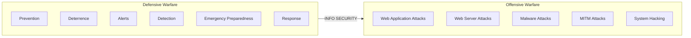

# Information Security Overview

Information is a critical organizational asset. When it falls into the wrong hands, the consequences are severe—financial losses, damaged reputation, lost customers. Understanding how to secure such vital resources requires knowledge of information security fundamentals. This section introduces the elements of information security, classification of attacks, and information warfare.

## Elements of Information Security

Information security is *"the state of well-being of information and infrastructure in which the possibility of theft, tampering, and disruption of information and services is low or tolerable."* It relies on five core elements:

| Element | Definition | Key Controls |
|---|---|---|
| **Confidentiality** | Information accessible only to authorized users | Data classification, encryption, secure disposal |
| **Integrity** | Trustworthiness of data; prevention of improper or unauthorized changes | Checksums, access control |
| **Availability** | Systems accessible when required by authorized users | Redundant disk arrays, clustered machines, DDoS prevention, antivirus |
| **Authenticity** | Ensures data/communications are genuine and uncorrupted | Biometrics, smart cards, digital certificates |
| **Non-Repudiation** | Sender cannot deny sending; recipient cannot deny receiving | Digital signatures |

> **Memory aid:** CIA + AN — Confidentiality, Integrity, Availability, Authenticity, Non-Repudiation.

## Information Security Attacks: Motives, Goals, and Objectives

An attack is an action performed with the intent to breach an IT system's security by exploiting its vulnerabilities — obtaining, editing, removing, destroying, or revealing information without authorized access.

**Attack formula:**

$$\text{Attack} = \text{Motive (Goal)} + \text{Method (TTP)} + \text{Vulnerability}$$

- A **motive** arises from the belief that the target system stores or processes something valuable.
- Attackers use tools and techniques (**TTPs**) to exploit vulnerabilities in systems, security policies, or controls.

### Motives Behind Information Security Attacks

- Disrupt business continuity
- Perform information theft or data manipulation
- Create fear and chaos by disrupting critical infrastructures
- Cause financial loss to the target
- Propagate religious or political beliefs
- Achieve a state's military objectives
- Damage the reputation of the target
- Take revenge
- Demand ransom

## Tactics, Techniques, and Procedures (TTPs)

TTPs refers to the **patterns of activities and methods** associated with specific threat actors or groups. Understanding TTPs enables security teams to profile adversaries, predict evolving threats, and strengthen defenses proactively.

| Component | Definition | Defensive Value |
|---|---|---|
| **Tactics** | The overall **strategy** an attacker follows from beginning to end of an attack | Predicts and detects evolving threats early |
| **Techniques** | The **technical methods** used to achieve intermediate results during an attack | Identifies vulnerabilities; enables advance countermeasures |
| **Procedures** | The **systematic approach** threat actors use to launch an attack | Reveals what the attacker is targeting within the infrastructure |

## Vulnerability

A vulnerability is a weakness in the design or implementation of a system that can be exploited to compromise its security — often a loophole that allows an attacker to bypass authentication or other controls. The two primary root causes are **misconfiguration** and **poor programming practices**.

### Weakness vs. Vulnerability

!!! tip "Exam-critical 🎯"

| Term | Definition |
|---|---|
| **Weakness** | A flaw in design, implementation, or operation that *reduces* security — not necessarily exploitable on its own. |
| **Vulnerability** | A weakness that *can be exploited* by a threat actor via a known method. |

Every vulnerability is a weakness, but not every weakness is a vulnerability. In the attack formula, the **Vulnerability** component is the exploitable gap — the point where motive meets method.

### Common Reasons for the Existence of Vulnerabilities

| Reason | Description |
|---|---|
| **Hardware/software misconfiguration** | Insecure configs create loopholes — e.g., unencrypted protocols leak data; misconfigured hardware grants network access; misconfigured software exposes applications and data |
| **Insecure or poor network/application design** | Improperly implemented firewalls, IDS, or VPNs expose the network to numerous threats |
| **Inherent technology weaknesses** | Hardware or software incapable of defending against certain attacks (e.g., DoS, MitM); outdated browsers prone to distributed attacks |
| **End-user carelessness** | Sharing credentials, connecting to insecure networks — exploitable via social engineering, leading to data loss or leakage |
| **Intentional end-user acts** | Ex-employees retaining access to shared drives and leaking sensitive information |

### Technological Vulnerabilities

| Type | Examples |
|---|---|
| **TCP/IP protocol** | HTTP, FTP, ICMP, SNMP, SMTP are inherently insecure |
| **Operating system** | Inherently insecure OS; unpatched systems |
| **Network devices** | Routers, firewalls, switches lacking password protection, authentication, using insecure routing protocols, or containing firewall vulnerabilities |

### Configuration Vulnerabilities

| Type | Description |
|---|---|
| **User account** | Insecure transmission of usernames/passwords over the network |
| **System account** | Weak passwords set for system accounts |
| **Internet service misconfiguration** | Enabling JavaScript insecurely; misconfiguring IIS, Apache, FTP, or Terminal services |
| **Default passwords/settings** | Leaving devices at factory defaults |
| **Network device misconfiguration** | Incorrectly configured network devices |

## Classification of Attacks

!!! tip "🎯 Exam-critical"

According to IATF, attacks fall into five categories:

| Type | Description | Examples |
|---|---|---|
| **Passive** | Intercept and monitor traffic without tampering — hard to detect, no active interaction | Footprinting, sniffing, eavesdropping, network traffic analysis, decryption of weakly encrypted traffic |
| **Active** | Tamper with data in transit or disrupt communication — detectable, actively sends traffic | DoS, MitM, session hijacking, spoofing, replay, SQL injection, XSS, malware, privilege escalation, DNS/ARP poisoning |
| **Close-in** | Attacker in physical proximity to gather, modify, or disrupt access to information | Social engineering, shoulder surfing, eavesdropping, dumpster diving |
| **Insider** | Trusted persons with physical/privileged access misuse it to violate CIA — difficult to detect | Wiretapping, data theft, pod slurping, planting keyloggers/backdoors/malware |
| **Distribution** | Hardware or software tampered with **at source or in transit** before installation | Backdoors inserted by vendors during manufacture or manufacture or distribution |

## Information Warfare

**Information warfare (InfoWar)** refers to the use of information and communication technologies (ICT) to gain competitive advantages over an opponent. Weapons include viruses, worms, Trojans, logic bombs, trap doors, electronic jamming, and penetration tools.

### Categories (Libicki)

| Category | Description |
|---|---|
| **Command & Control (C2)** | Impact an attacker has over a compromised system or network they control |
| **Intelligence-based** | Sensor-based technology that corrupts technological systems; design, protection, and denial of knowledge-seeking systems |
| **Electronic** | Uses radio-electronic and cryptographic techniques to degrade communication |
| **Psychological** | Propaganda and terror to demoralize adversaries |
| **Hacker** | System shutdown, data errors, theft of information/services, false messaging — uses viruses, logic bombs, Trojans, sniffers |
| **Economic** | Blocks information flow to damage the economy of a business or nation |
| **Cyberwarfare** | Broadest category; includes information terrorism, semantic attacks (taking over systems while appearing normal), and simula-warfare |

### Defensive vs. Offensive Information Warfare

| | Defensive | Offensive |
|---|---|---|
| **Goal** | Defend ICT assets against attacks | Attack the ICT assets of an opponent |
| **Strategies** | Prevention, deterrence, alerts, detection, emergency preparedness, response | Web application attacks, web server attacks, malware attacks, MitM attacks, system hacking |

