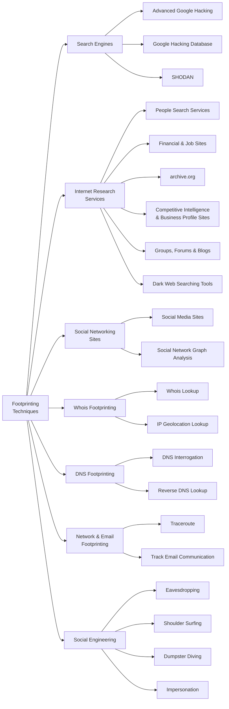

# Footprinting Concepts

Footprinting acts as a preparatory phase for the attacker, who needs to gather as much information as possible to find ways to intrude into the target network. This section covers what footprinting is, why it is necessary, and its objectives.

## Definition

Reconnaissance (also known as footprinting) is the preparatory phase where an attacker seeks to **gather as much information as possible** about a target of evaluation prior to launching an attack.

Footprinting is the **first step in ethical hacking**. It involves collecting information about a target network and its environment to uncover vulnerabilities and identify exploitation paths. The result is a **blueprint** — a unique system profile of the target organization.

Key characteristics:

- No single methodology; information can be traced in multiple ways
- Must be carried out in an organized, methodical manner
- Identifies the level of risk associated with publicly accessible information
- Uncovers vulnerabilities and ways to exploit them before the attack phase

## Types of Footprinting

!!! tip "Exam-critical 🎯"

| | Passive | Active |
|---|---|---|
| **Interaction** | No direct interaction with the target | Direct interaction with the target |
| **Detectability** | Difficult to detect | Target may recognize the activity |
| **Preparation** | Less preparation needed | More preparation required; may leave traces |
| **Examples** | OSINT, search engines, social networking sites | DNS interrogation, social engineering, port scanning |

### Passive Footprinting

Gathering information **without direct interaction**. Useful when the activity must not be detected. Only archived and stored information is collected.

It involves:

- Open-source Intelligence (OSINT) gathering
- Proprietary databases and paid services
- Sharing intelligence with partner organizations or industry groups

### Active Footprinting

Gathering information **with direct interaction**. The target may recognize the ongoing process. Requires more preparation as it may leave traces.

It involves:

- DNS interrogation
- Social engineering
- Network/port scanning
- User and service enumeration

## Information Obtained in Footprinting

The major objectives of footprinting include collecting network, system, and organizational information about the target. Such information helps attackers gain access to sensitive data or perform various attacks.

| Organization Information | Network Information | System Information |
|---|---|---|
| Employee details (names, contact, designation) | Domain and sub-domains | Web server OS |
| Addresses and phone numbers | Network blocks | Location of web servers |
| Branch and location details | Network topology, trusted routers, and firewalls | Publicly available email addresses |
| Background of the organization | IP addresses of reachable systems | Usernames and passwords |
| Web technologies | Whois records | |
| News articles, press releases, related documents | DNS records | |
| Legal documents, patents, trademarks | | |

## Objectives of Footprinting

- Build a hacking strategy by mapping the target organization's network
- Identify the easiest way to breach the security perimeter
- Obtain an outline of the security posture: placement of firewalls, proxies, and other solutions
- Reduce an unknown entity to a specific range of domain names, network blocks, and IP addresses
- Identify vulnerabilities in target systems to select appropriate exploits
- Build an information database of security weaknesses to find the weakest link

## Footprinting Threats

| Threat | Description |
|---|---|
| **Social Engineering** | Hackers collect information through persuasion; willing employees unknowingly reveal sensitive data |
| **System and Network Attacks** | Information about OS and configuration is used to find and exploit vulnerabilities, potentially taking control of systems or the entire network |
| **Information Leakage** | Sensitive data in attacker hands enables targeted attacks or monetary exploitation |
| **Privacy Loss** | Attackers access systems and escalate privileges to admin level, compromising privacy of the organization and its personnel |
| **Corporate Espionage** | Competitors use footprinting to acquire sensitive data, launch similar products, alter prices, and undermine market position |
| **Business Loss** | Malicious attacks enabled by footprinting cost organizations — especially e-commerce, banking, and finance — billions annually |

## Footprinting Methodology

The footprinting methodology is a procedure for collecting information about a target organization from all available sources — URLs, locations, establishment details, employee count, domain ranges, contact information, and more. Attackers collect this information from publicly accessible sources such as search engines, social networking sites, and Whois databases.

