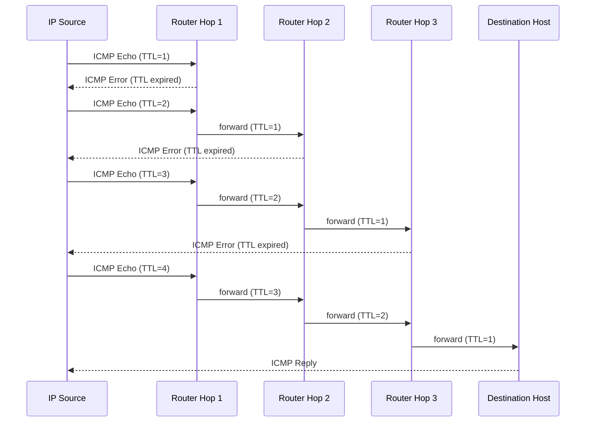
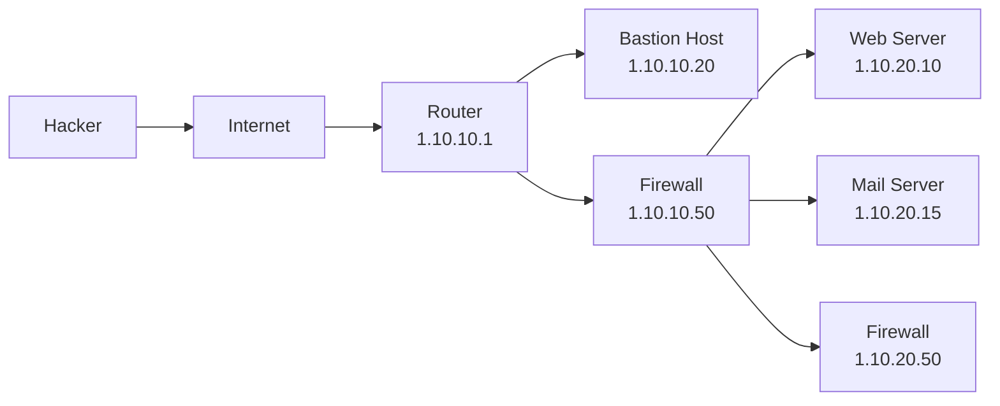

# Network and Email Footprinting

After gathering DNS information, an attacker moves to network footprinting and email tracking. This page covers locating the network range, traceroute analysis, and the tools involved.

## Locate the Network Range

To determine a target's **network range**, an attacker enters the server IP address (gathered during Whois footprinting) into the **ARIN Whois database** at [arin.net](https://www.arin.net/about/welcome/region). Detailed IP allocation data is stored in the appropriate **regional registry database**. The result yields the full network range, subnet mask, and route information for the target.

### What Network Range Reveals

| Information | Detail |
|---|---|
| Network organization | Which machines are alive and topology layout |
| Access control devices | Firewalls, routers, and gateways in use |
| Operating systems | OS types running in the target network |

### IANA Private IP Address Ranges

The **Internet Assigned Numbers Authority (IANA)** has reserved three blocks for private internets:

| Range | Prefix |
|---|---|
| 10.0.0.0 – 10.255.255.255 | 10/8 |
| 172.16.0.0 – 172.31.255.255 | 172.16/12 |
| 192.168.0.0 – 192.168.255.255 | 192.168/16 |

Obtaining private IP addresses is valuable to attackers, as these addresses reveal the internal network structure.

### DNS Misconfiguration

Improperly configured DNS servers offer attackers a chance to obtain a **list of internal machines** in the network. Traceroute can also expose the **internal IP address of the gateway**.

> Attackers typically use more than one tool to obtain network information, as no single tool provides all required details.

## Traceroute

Traceroute programs work on the concept of **ICMP (Internet Control Message Protocol)** and use the **TTL (Time to Live) field** in the header of ICMP packets to discover routers on the path to a target host. The utility reveals:

- Number of **routers (hops)** the packets travel through
- **Round-trip time (RTT)** between routers
- **Names and network affiliation** of routers (if DNS entries exist)
- **Geographic locations** of intermediate hops

### How TTL Works

Each router on the path **decrements the TTL by 1**. When TTL reaches zero, the router discards the packet and returns an **ICMP error message** to the source, revealing its IP address. Traceroute starts with TTL=1 and increments by 1 for each probe until a packet finally reaches the destination, which responds with a normal **ICMP reply**.

### Traceroute Types

| Type | Protocol | Default OS | Command |
|---|---|---|---|
| ICMP Traceroute | ICMP | Windows | `tracert <target>` |
| TCP Traceroute | TCP (Layer 4) | Linux | `sudo tcptraceroute <target>` |
| UDP Traceroute | UDP (Layer 4) | Linux | `traceroute <target>` |

TCP and UDP traceroutes (Layer 4) are used when network devices are configured to **block ICMP messages**.

### Traceroute with AI

Attackers can use AI-powered tools such as **ChatGPT** to automate tracerouting via a natural-language prompt:

> *"Perform network tracerouting to discover the routers on the path to a target host www.certifiedhacker.com"*

The AI generates and executes the appropriate shell command: `traceroute www.certifiedhacker.com`

## Traceroute Analysis

By running multiple traceroutes to different hosts in the target network, an attacker can map intermediate devices and reconstruct the network topology. The last few hops before each destination reveal the routers and firewalls protecting it.

| Destination | 3rd-to-last hop | 2nd-to-last hop |
|---|---|---|
| 1.10.10.20 (Bastion Host) | — | 1.10.10.1 (Router) |
| 1.10.20.10 (Web Server) | 1.10.10.1 (Router) | 1.10.10.50 (Firewall) |
| 1.10.20.15 (Mail Server) | 1.10.10.1 (Router) | 1.10.10.50 (Firewall) |

Compiling these results, the attacker identifies the intermediate devices — router, firewall, and DMZ hosts — and their positions in the network path.

## Traceroute Tools

Traceroute tools extract information about the geographical location of routers, servers, and IP devices in a network. Common features include:

- Hop-by-hop traceroutes, reverse tracing, and historical analysis
- Packet loss reporting, latency monitoring, and performance metrics
- Reverse DNS, port probing, and network problem detection

| Tool | Key Capability |
|---|---|
| [**NetScanTools Pro**](https://www.netscantools.com) | ICMP, UDP, or TCP traceroute; identifies intermediate devices; maps country per IPv4 hop |
| [**PingPlotter**](https://www.pingplotter.com) | ICMP, UDP, and TCP traceroute; tracks latency and packet loss over time; visualizes data in graphs; identifies bandwidth bottlenecks and hardware faults |
| **Traceroute NG** | Network path analysis with continuous probing |
| **tracert** | Built-in Windows ICMP traceroute utility |

## Tracking Email Communications

Email tracking monitors email messages of a particular user via digitally time-stamped records that reveal when a target receives and opens a specific email. Attackers use this to collect IP addresses, mail servers, and service provider details to build a hacking strategy and perform social engineering.

### Information Gathered via Email Tracking

| Field | What It Reveals |
|---|---|
| Recipient's IP Address | Tracks the recipient's IP address |
| Geolocation | Estimates location on a map; may calculate distance from attacker |
| Email Received and Read | Notifies attacker when email is received and opened |
| Read Duration | Time spent by recipient reading the email |
| Proxy Detection | Type of server used by the recipient |
| Links | Whether links in the email were clicked |
| OS and Browser | OS and browser version — used to find exploitable vulnerabilities |
| Forward Email | Whether the email was forwarded to another person |
| Device Type | Desktop, mobile, or laptop used to open the email |
| Path Travelled | Route through email transfer agents from source to destination |

## Collecting Information from Email Header

An email header contains sender details, routing information, addressing scheme, date, subject, and recipient — and reveals the routing path taken before delivery. Each field is a potential source of attacker intelligence.

**Fields in an email header:**

- Sender's mail server
- Date and time received by the originator's email servers
- Authentication system used by the sender's mail server
- Date and time the message was sent
- Unique message ID assigned by the mail server (e.g., mx.google.com)
- Sender's full name
- Sender's IP address and the address from which the message was sent

Commonly used email programs that expose headers include: eM Client, Mailbird, Hiri, Mozilla Thunderbird, Spike, Claws Mail, SmarterMail Webmail, Outlook, Apple Mail, ProtonMail, AOL Mail, and Tuta.

## Email Tracking Tools

Email tracking tools allow attackers to trace the email path from source to target mail server using IP addresses found in the email header.

| Tool | Key Capability |
|---|---|
| [**eMailTrackerPro**](http://www.emailtrackerpro.com) | Analyzes email headers; extracts geographical location and IP; saves past traces for later review |
| [**IP2LOCATION Email Header Tracer**](https://www.ip2location.com) | Open-source; traces email path and mail servers using IP addresses in the header |
| **MxToolbox** | DNS and email header analysis |
| **DNS Checker Email Header Analyzer** | Email header parsing and analysis |
| **Social Catfish** | Identity verification through email tracking |
| **Holehe** | Checks email account usage across platforms |
