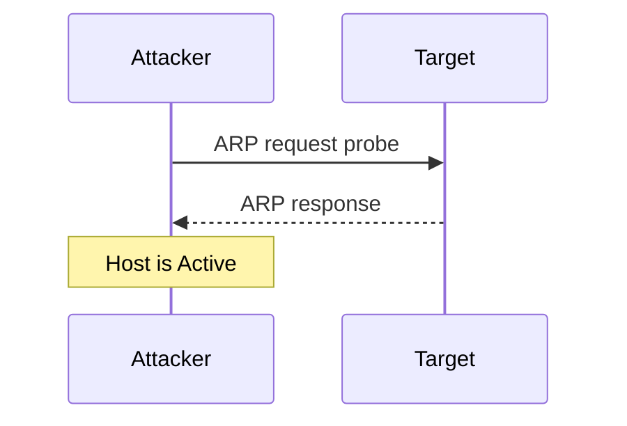
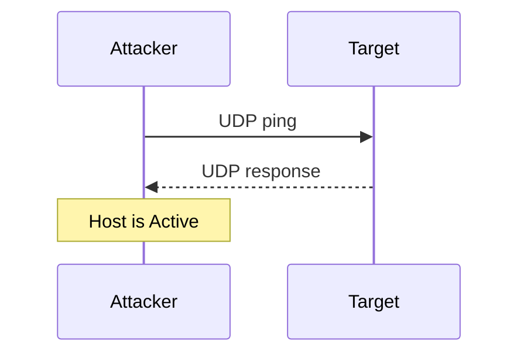
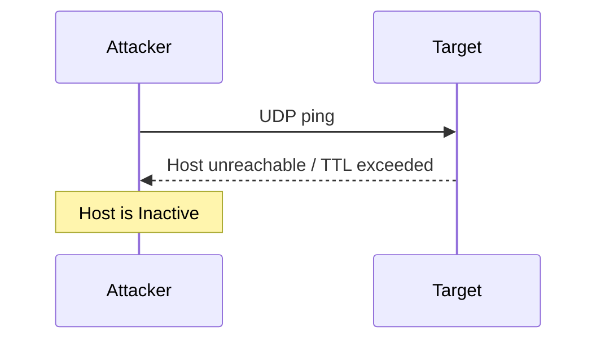
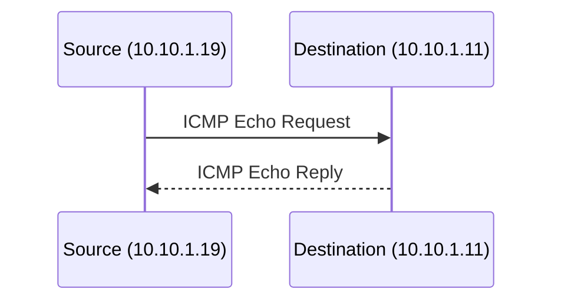
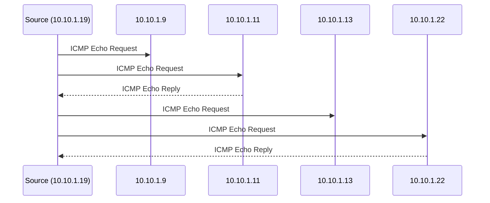
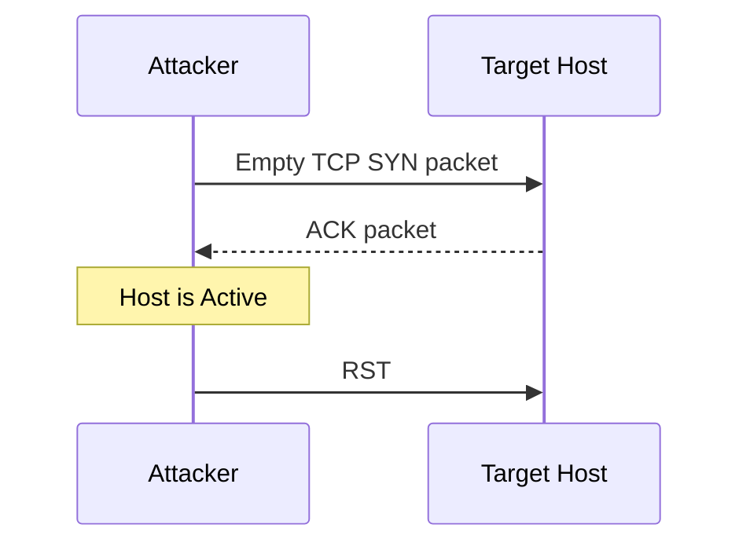
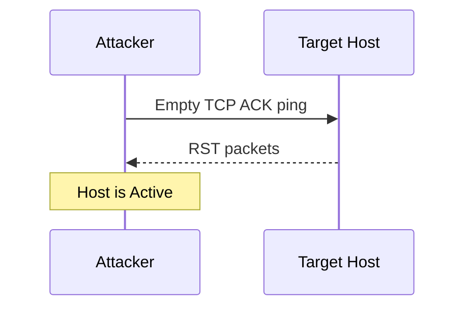
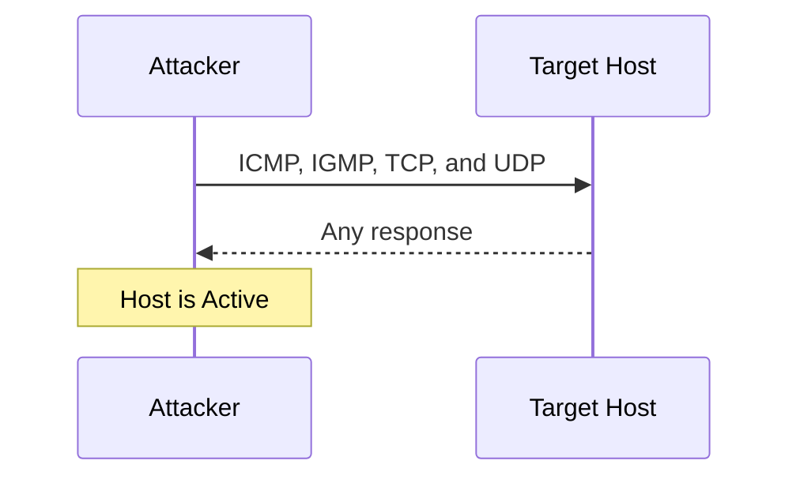

# Host Discovery

Scanning is the process of gathering information about systems that are "alive" and responding on the network. Host discovery is considered the **primary task** in the network scanning process — to perform a complete scan and identify open ports and services, it is necessary to first check for live systems.

Host discovery is the **first step in network scanning**. It provides an accurate status of the systems in the network, which enables an attacker to avoid scanning every port on every system in a list of IP addresses to identify whether the target host is up. Live systems can be checked using various **ping scan** techniques, and a network can be **ping swept** to detect live hosts/systems, using various ping sweep tools.

## Host Discovery Techniques

!!! tip "Exam-critical 🎯"

Host discovery techniques can be adopted to discover the active/live hosts in the network. As an ethical hacker, you must be aware of the various types of host discovery techniques:

| Category | Sub-technique | Command |
|---|---|---|
| **ARP Ping Scan** | — | `nmap -sn -PR <Target IP>` |
| **UDP Ping Scan** | — | `nmap -sn -PU <Target IP>` |
| **ICMP Ping Scan** | ICMP ECHO Ping | `nmap -sn -PE <Target IP>` |
| | ICMP ECHO Ping Sweep | `nmap -sn -PE <IP Range>` |
| | ICMP Timestamp Ping | `nmap -sn -PP <Target IP>` |
| | ICMP Address Mask Ping | `nmap -sn -PM <Target IP>` |
| **TCP Ping Scan** | TCP SYN Ping | `nmap -sn -PS <Target IP>` |
| | TCP ACK Ping | `nmap -sn -PA <Target IP>` |
| **IP Protocol Scan** | — | `nmap -sn -PO <Target IP>` |

### Ping Sweep Tools

Ping sweep tools ping an entire range of network IP addresses to identify live systems, sending multiple ICMP ECHO requests to various hosts on the network at a time.

*Source: [angryip.org](https://angryip.org)*

**Angry IP Scanner** is an IP address and port scanner that can scan IP addresses in any range, along with any of their ports. It pings each IP address to check if it is alive, then optionally resolves its hostname, determines its MAC address, scans ports, and more — the amount of data gathered per host increases with plugins. It also offers NetBIOS information (computer name, workgroup name, currently logged-in Windows user), favorite IP address ranges, web server detection, and customizable openers, and can save results to CSV, TXT, XML, or IP-Port list files. To increase scanning speed, it uses a multithreaded approach, creating a separate scanning thread for each scanned IP address.

### Additional Ping Sweep Tools

| Tool | Source |
|---|---|
| **SolarWinds Engineer's Toolset** | [solarwinds.com](https://www.solarwinds.com) |
| **NetScanTools Pro** | [netscantools.com](https://www.netscantools.com) |
| **Colasoft Ping Tool** | [colasoft.com](https://www.colasoft.com) |
| **Advanced IP Scanner** | [advanced-ip-scanner.com](https://www.advanced-ip-scanner.com) |
| **OpUtils** | [manageengine.com](https://www.manageengine.com) |

## ARP Ping Scan

An **ARP (Address Resolution Protocol)** ping scan sends ARP packets to discover all active devices in an IPv4 range, even when their presence is hidden by restrictive firewalls. In most networks, many IP addresses — especially in private LAN ranges — are unused at any given time. When an attacker sends an IP packet (e.g., an ICMP echo request) to a target host, the OS must first resolve the target's hardware (MAC) address via ARP to address the Ethernet frame correctly, which triggers a series of ARP requests.

- ARP scan reveals the MAC address of a device's network interface, and can also show the MAC addresses of all devices sharing the same IPv4 address on the LAN
- If the target IP with its hardware address is active, the host generates an ARP response; otherwise, after a certain number of attempts, the OS gives up on the host
- In other words: if the attacker's ARP request probe receives any ARP response, the host is active
- If the destination host is unresponsive, the source host adds an incomplete entry for that IP in its kernel ARP table
- Attackers use the **Nmap** tool to perform an ARP ping scan for discovering live hosts in the network; in **Zenmap**, the `-PR` option is used to perform it

!!! note
    `-sn` is the Nmap command to disable the port scan. Since Nmap uses ARP ping scan as its **default** ping scan, `--disable-arp-ping` is used to disable it and perform other desired ping scans instead.

**ARP ping scan**

### Advantages

- Considered more efficient and accurate than other host discovery techniques
- Automatically handles ARP requests, retransmission, and timeout at its own discretion
- Useful for system discovery, where large address spaces may need to be scanned
- Can display the response time/latency of a device to an ARP packet

## UDP Ping Scan

A UDP ping scan is similar to a TCP ping scan, but Nmap sends UDP packets to the target host. The default port Nmap uses for a UDP ping scan is **40,125** — a highly uncommon port chosen deliberately for this purpose. This default can be reconfigured via `DEFAULT_UDP_PROBE_PORT_SPEC` at compile time in Nmap. In Zenmap, the `-PU` option performs the UDP ping scan.

- A UDP response from the target host means the host is **active**
- If the host is offline or unreachable, error messages such as **host/network unreachable** or **TTL exceeded** may be returned instead

**UDP ping scan to determine if the host is active**

**UDP ping scan to determine if the host is offline**

### Advantages

- Can detect systems behind firewalls with strict TCP filtering, since UDP traffic is often left unfiltered/forgotten

## ICMP ECHO Ping Scan

Attackers use an **ICMP (Internet Control Message Protocol)** ping scan to send ICMP packets to the destination system to gather all necessary information about it. Since ICMP does not include port abstraction, this differs from port scanning — but it is still useful for determining which hosts in a network are running, by pinging them all.

An ICMP ECHO ping scan sends **ICMP ECHO requests** to a host. If the host is alive, it returns an **ICMP ECHO reply**. This scan is useful for locating active devices or determining whether ICMP is passing through a firewall.

**ICMP echo request and reply**

- **UNIX/Linux and BSD-based** machines use ICMP echo scanning — their TCP/IP stack implementations respond to ICMP echo requests sent to broadcast addresses
- This technique **does not work on Windows-based networks**, as Windows' TCP/IP stack implementation does not reply to ICMP probes directed at the broadcast address
- Nmap uses the `-P` option to ICMP scan the target; the `-L` option increases the number of pings sent in parallel, and the `-T` option tweaks the ping timeout value
- In Zenmap, the `-PE` option performs the ICMP ECHO ping scan; active hosts are displayed as **"Host is up"**

## ICMP ECHO Ping Sweep

A **ping sweep** (also known as an ICMP sweep) is a basic network scanning technique used to determine the range of IP addresses that map to live hosts. While a single ping only tells whether one specified host exists on the network, a ping sweep sends ICMP ECHO requests to multiple hosts at once — each active host returns an ICMP ECHO reply. Ping sweeps are among the oldest and slowest network scanning methods, but the utility is distributed across nearly all platforms. It acts as a roll call for systems: an active system answers the ping query sent to it.

ICMP echo scanning pings all the machines in the target network to discover live machines. Attackers send ICMP probes to the broadcast or network address, which relays them to all host addresses in the subnet, and live systems send an ICMP echo reply back to the source of the probe.

**ICMP ECHO Ping Sweep**

### TCP/IP Packet Details

- A ping sends a single **64-byte** packet (56 data bytes + 8 bytes of protocol header information) to a specific IP address, then waits/listens for a return packet
- A good return packet is expected if the connection is good and the target is "alive"; a disruption in communication prevents this
- Pings report the **round-trip time** — the time taken for a packet to make a complete trip
- Pings also help resolve hostnames: if a packet bounces back when sent to an IP address but not when sent to a name, the system is unable to reconcile the name with that specific IP address

### ICMP ECHO Ping Sweep Using Nmap

*Source: [nmap.org](https://nmap.org)*

- Attackers calculate subnet masks using subnet mask calculators to identify the number of hosts present in a subnet, then use a ping sweep to build an inventory of live systems in that subnet
- **Nmap** helps an attacker perform a ping sweep to determine live hosts from a range of IP addresses; in Zenmap, the `-PE` option with a list of IP addresses is used to perform an ICMP ECHO ping sweep

## ICMP Timestamp Ping Scan

Besides the traditional ICMP ECHO ping, other ICMP pinging techniques exist for specific conditions — such as the ICMP timestamp ping scan and ICMP address mask ping scan.

An ICMP timestamp ping is an optional, additional type of ICMP ping in which the attacker queries a timestamp message to acquire information about the current time from the target host machine. The target machine responds with a timestamp reply to each timestamp query it receives. However, this response is conditional — the destination host may or may not respond with the time value, depending on its configuration by the administrator.

- Generally used for **time synchronization**
- Effective at identifying whether the destination host is active, especially when the administrator blocks traditional ICMP ECHO ping requests
- In Zenmap, the `-PP` option is used to perform an ICMP timestamp ping scan

## ICMP Address Mask Ping Scan

An ICMP address mask ping is another alternative to the traditional ICMP ECHO ping, where the attacker sends an ICMP address mask query to the target host to acquire information about its subnet mask. However, the address mask response from the destination host is conditional — it may or may not respond with the appropriate subnet value, depending on its configuration by the administrator.

- Effective at identifying active hosts, similarly to the ICMP timestamp ping, specifically when the administrator blocks traditional ICMP ECHO ping requests
- In Zenmap, the `-PM` option is used to perform an ICMP address mask ping scan

## TCP SYN Ping Scan

A TCP SYN ping is a host discovery technique for probing different ports to determine whether a port is online and whether it encounters any firewall rule sets. The attacker uses Nmap to initiate a three-way handshake by sending an empty TCP SYN flag to the target host.

1. The attacker sends an empty **TCP SYN** packet to the target host
2. The target host acknowledges receipt with an **ACK** flag
3. After receiving the ACK, the attacker confirms the target host is active and terminates the connection by sending an **RST** flag — since the objective of host discovery is already accomplished

**TCP SYN ping scan for host discovery**

- Port **80** is used as the default destination port
- A range of ports can be specified without a space between `-PS` and the port numbers (e.g., `-PS22-25,80,113,1050,35000`), probing each port in parallel
- In Zenmap, the `-PS` option is used to perform a TCP SYN ping scan

### Advantages

- Since machines can be scanned in parallel, the scan never encounters a time-out error while waiting for a response
- Can determine if a host is active without creating any connection, so logs are not recorded at the system or network level — leaving the attacker no traces for detection

## TCP ACK Ping Scan

A TCP ACK ping is similar to a TCP SYN ping, with minor variations, and also uses default port **80**. The attacker sends an empty **TCP ACK** packet directly to the target host. Since there is no prior connection between attacker and target, the target host responds with an **RST** flag to terminate the request — reception of this RST packet at the attacker's end indicates that the host is active.

**TCP ACK ping scan for host discovery**

- In Zenmap, the `-PA` option is used to perform a TCP ACK ping scan

### Advantages

- Both SYN and ACK packets can be used together to maximize the chances of bypassing a firewall
- Firewalls are mostly configured to block SYN ping packets, as they are the most common pinging technique — in such cases, the ACK probe can effectively bypass these firewall rule sets

## IP Protocol Ping Scan

An IP protocol ping is the latest host discovery option, sending IP ping packets with the IP header of any specified protocol number — using the same format as TCP and UDP pings. This technique sends different packets using different IP protocols, hoping to get a response indicating that a host is online.

**IP protocol ping scan for host discovery**

- By default, when no protocols are specified, multiple IP packets are sent for **ICMP (protocol 1)**, **IGMP (protocol 2)**, and **IP-in-IP (protocol 4)**
- The default protocols can be reconfigured via `DEFAULT_PROTO_PROBE_PORT_SPEC` in `nmap.h` at compile time
- For specific protocols such as ICMP, IGMP, TCP (protocol 6), and UDP (protocol 17), packets are sent with proper protocol headers; for remaining protocols, only IP header data is sent
- Attackers send different probe packets of different IP protocols to the target host — any response from any probe indicates the host is online
- In Zenmap, the `-PO` option is used to perform an IP protocol ping scan

## Host Discovery with AI

Attackers can leverage AI-powered technologies to enhance and automate host discovery tasks. With the aid of AI, attackers can effortlessly find out the live hosts on a target — for instance, by giving ChatGPT an appropriate natural-language prompt that generates a ready-to-run Nmap command.

### Example 1: Extract Active Host IPs to a File

Prompt: *"Scan the target network 10.10.1.0/24 for active hosts and place only the IP addresses into a file scan1.txt"*

`nmap -sn 10.10.1.0/24 -OG- | awk '/Up$/{print $2}' > scan1.txt`

- `nmap` — invokes Nmap, a powerful network scanning tool
- `-sn` — specifies a ping scan ("ping sweep"), where Nmap sends ICMP echo requests to discover live hosts without further probing ports
- `10.10.1.0/24` — the target IP range in CIDR notation, denoting all addresses from 10.10.1.0 to 10.10.1.255
- `-OG-` — outputs the scan results in a grepable format, which can be processed by the subsequent `awk` command
- `| awk '/Up$/{print $2}'` — pipes the Nmap output to `awk`, which filters lines containing "Up" (indicating the host is up) and prints the second field, the host's IP address
- `> scan1.txt` — redirects the filtered list of live-host IP addresses into `scan1.txt`

### Example 2: Comprehensive Scan Against a Host List

Prompt: *"Run a fast but comprehensive Nmap scan against scan1.txt with low verbosity and write the results to scan2.txt"*

`nmap -T4 -iL scan.txt -oN scan2.txt -v0`

- `nmap` — invokes Nmap, a powerful network scanning tool
- `-T4` — sets the timing template to "aggressive," instructing Nmap to execute the scan with faster timing and performance
- `-iL scan.txt` — specifies the input file containing the list of target IP addresses/hostnames to scan
- `-oN scan2.txt` — specifies the file where the scan results will be saved
- `-v0` — sets the verbosity level to 0, so Nmap displays no output except errors, keeping the scan low-verbosity

This command executes an Nmap scan using aggressive timing against the targets listed in `scan.txt`, saves the results to `scan2.txt`, and suppresses all non-error output.

### Example 3: ICMP ECHO Ping Sweep

Prompt: *"Use Nmap to perform ICMP ECHO ping sweep on the target network 10.10.1.0/24"*

`nmap -sn -PE 10.10.1.0/24`

- `nmap` — invokes Nmap, a powerful network scanning tool
- `-sn` — specifies a ping scan ("ping sweep"), where Nmap sends ICMP echo requests to discover live hosts without further probing ports
- `-PE` — specifies that ICMP echo requests should be used for host discovery during the ping scan
- `10.10.1.0/24` — the target IP range in CIDR notation, denoting all addresses from 10.10.1.0 to 10.10.1.255

This command instructs Nmap to perform a ping scan on the range 10.10.1.0/24 using ICMP echo requests to discover live hosts.

## Tooling

### Nmap

*Source: [nmap.org](https://nmap.org)*

**Nmap** ("Network Mapper") is the command-line security scanner used throughout host discovery to determine which hosts on a network are live, without performing a full port scan. Combined with the `-sn` flag, it sends the various ARP, UDP, ICMP, and TCP probes to determine which targets respond.

| Flag | Example Command | Purpose |
|---|---|---|
| `-sn` | `nmap -sn <Target IP>` | Disables port scanning and performs host discovery ("ping scan") only |
| `-PR` | `nmap -sn -PR <Target IP>` | Performs an ARP ping scan (Nmap's default ping scan on a local network) |
| `--disable-arp-ping` | `nmap --disable-arp-ping -sn <Target IP>` | Disables the default ARP ping scan so another specified ping type is used instead |
| `-PU` | `nmap -sn -PU <Target IP>` | Performs a UDP ping scan |
| `-PE` | `nmap -sn -PE <Target IP>` | Performs an ICMP ECHO ping scan; used with an IP range to perform an ICMP ECHO ping sweep |
| `-PP` | `nmap -sn -PP <Target IP>` | Performs an ICMP timestamp ping scan |
| `-PM` | `nmap -sn -PM <Target IP>` | Performs an ICMP address mask ping scan |
| `-PS` | `nmap -sn -PS <Target IP>` (e.g. `-PS22-25,80,113,1050,35000` for a port range) | Performs a TCP SYN ping scan (default port 80) |
| `-PA` | `nmap -sn -PA <Target IP>` | Performs a TCP ACK ping scan (default port 80) |
| `-PO` | `nmap -sn -PO <Target IP>` | Performs an IP protocol ping scan |
| `-L` | `nmap -PE -L <Target IP>` | Increases the number of pings sent in parallel |
| `-T` | `nmap -PE -T <value> <Target IP>` | Tweaks the ping timeout value |

*Additional reference: [nmap(1) — Linux man page](https://linux.die.net/man/1/nmap)*

| Flag | Example Command | Purpose |
|---|---|---|
| `-p` | `nmap -p 22,80,443 <Target IP>` | Specifies which port(s) to scan |
| `-p-` | `nmap -p- <Target IP>` | Scans all 65,535 ports |
| `-F` | `nmap -F <Target IP>` | Fast mode — scans fewer ports (only those listed in `nmap-services`) instead of the default range |
| `-s<type>` | `nmap -sS <Target IP>` | Prefix for selecting a scan type, e.g. `-sS` (TCP SYN scan), `-sT` (TCP connect scan), `-sU` (UDP scan) |
| `-sC` | `nmap -sC <Target IP>` | Runs Nmap's default set of Nmap Scripting Engine (NSE) scripts |
| `-sX` | `nmap -sX <Target IP>` | Performs a Xmas scan by setting the FIN, PSH, and URG flags |
| `-sn` | `nmap -sn <Target IP>` | Disables port scanning and performs host discovery only (see the host discovery flag table above) |
| `-Pn` | `nmap -Pn <Target IP>` | Skips host discovery entirely and treats all specified hosts as online, scanning them directly |
| `-f` | `nmap -f <Target IP>` | Fragments probe packets into smaller pieces to evade packet filters and intrusion detection systems |
| `-O` | `nmap -O <Target IP>` | Enables OS detection |
| `-T<0-5>` | `nmap -T4 <Target IP>` | Sets a timing template controlling scan speed, from `-T0` (paranoid/slowest) to `-T5` (insane/fastest) |
| `-o<format>` | `nmap -oN output.txt <Target IP>` | Prefix for saving scan output to a file, e.g. `-oN` (normal), `-oX` (XML), `-oG` (grepable), `-oA` (all formats) |

### Zenmap

*Source: [nmap.org/zenmap](https://nmap.org/zenmap/)*

**Zenmap** is the official graphical front-end for Nmap, letting an attacker or administrator select and run the same host discovery ping scans through a GUI instead of typing raw Nmap syntax. Active hosts found via ICMP ECHO scans are displayed as **"Host is up"**.

| Option | Purpose |
|---|---|
| `-PR` | Performs an ARP ping scan |
| `-PU` | Performs a UDP ping scan |
| `-PE` | Performs an ICMP ECHO ping scan on a single host; with a list of IP addresses, performs an ICMP ECHO ping sweep |
| `-PP` | Performs an ICMP timestamp ping scan |
| `-PM` | Performs an ICMP address mask ping scan |
| `-PS` | Performs a TCP SYN ping scan |
| `-PA` | Performs a TCP ACK ping scan |
| `-PO` | Performs an IP protocol ping scan |