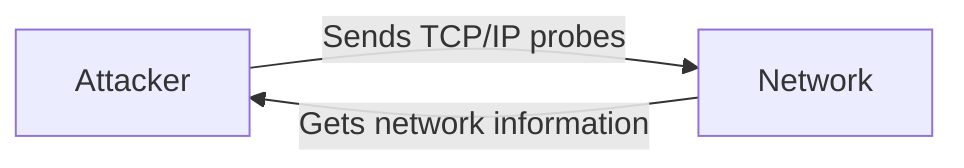
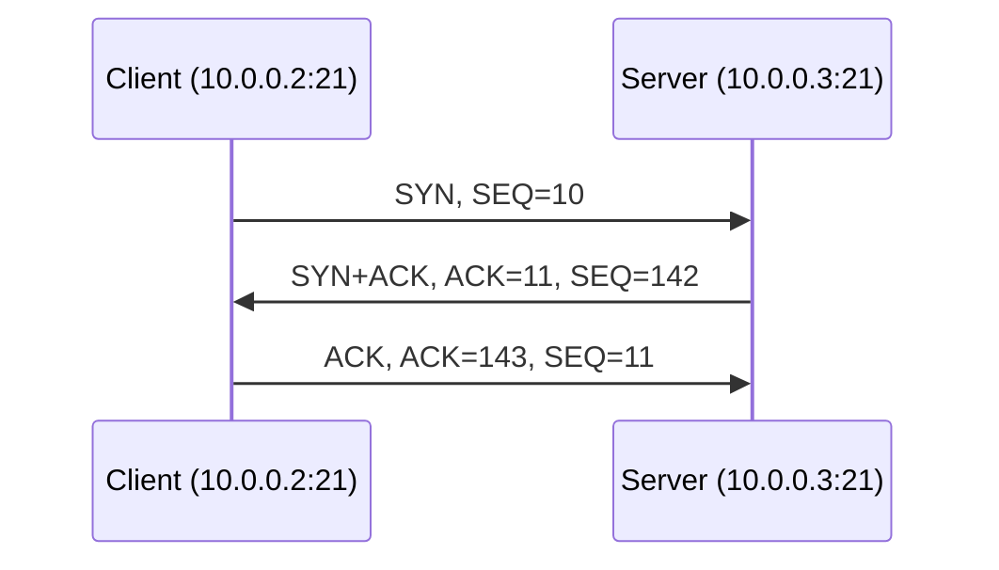
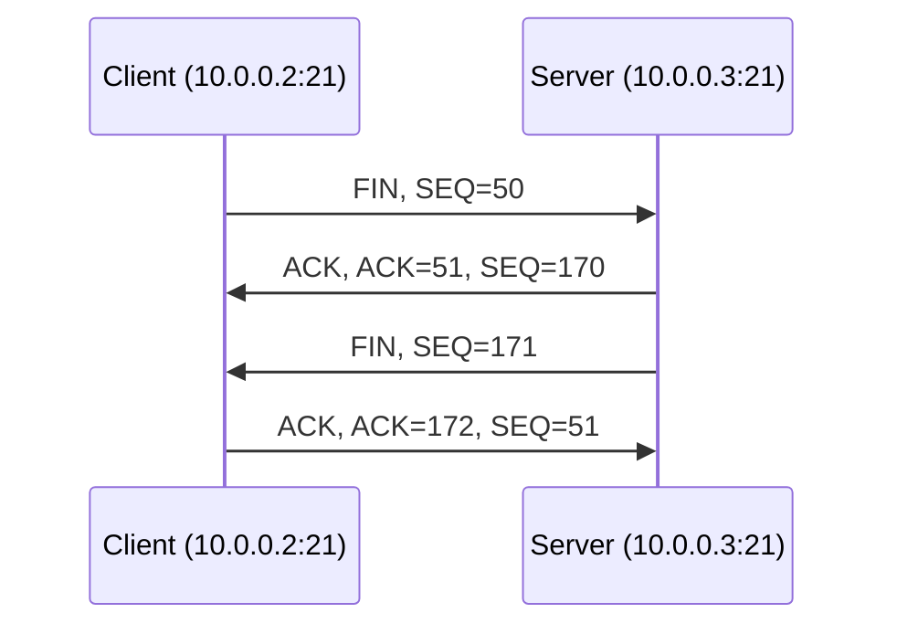

# Network Scanning Concepts

Footprinting is the first phase of hacking, in which the attacker gains primary information about a potential target. The attacker then uses this information in the **scanning phase** to gather more details about the target.

## Overview of Network Scanning

Scanning is the process of gathering additional detailed information about the target using more complex and aggressive reconnaissance techniques than footprinting. Network scanning refers to a set of procedures for identifying **hosts, ports, and services** in a network, discovering active machines, and identifying the OS running on the target.

Network scanning is one of the most important phases of information gathering, enabling the attacker to build a profile of the target organization. The attacker gathers information such as reachable IP addresses, the target's OS and system architecture, and the ports and services running on each host, then uses it to develop an attack strategy — discovering exploitable communication channels and tracking the listeners most useful to the attacker.

Common tools used for network scanning include **Nmap, Hping3, Metasploit, and NetScanTools Pro**.

## Types of Scanning

| Type | Description |
|---|---|
| **Port Scanning** | Lists open ports and services. Probes TCP/UDP ports to determine whether services are running or listening; a listening state reveals OS and application details and may expose misconfigurations or vulnerable software. |
| **Network Scanning** | Lists active hosts and IP addresses. Identifies active hosts on a network, either to attack them or to assess the network's security. |
| **Vulnerability Scanning** | Shows the presence of known weaknesses by checking whether a system is exploitable. A vulnerability scanner uses a scanning engine plus a catalog of files/exploits with known vulnerabilities; it mainly targets weaknesses fixable through security patches. |

Ports act as the doors and windows of a system that an intruder uses to gain access. Generally, the more open ports a system has, the more vulnerable it is — though a system with fewer open ports can sometimes be more vulnerable than one with more.

## Objectives of Network Scanning

- Discover the network's live hosts, IP addresses, and open ports of live hosts, to determine the best means of entry
- Discover the OS and system architecture of the target (**fingerprinting**), to formulate an attack strategy based on OS vulnerabilities
- Discover services running/listening on the target system, indicating vulnerabilities that can be exploited
- Identify specific applications or versions of a particular service
- Identify vulnerabilities in network systems to compromise the target through various exploits
- Map out the network topology, including devices, routers, switches, and their interconnections

## TCP Communication Flags

!!! tip "Exam-critical 🎯"

Standard TCP communications are controlled by flags in the TCP packet header. Six 1-bit TCP control flags (6 bits total in the TCP Flags field) manage the connection between hosts and give instructions to the system. Setting a flag's value to `1` turns it on.

- **SYN, ACK, FIN, RST** — govern the establishment, maintenance, and termination of a connection
- **PSH, URG** — provide processing instructions to the system

| Flag | Name | Function |
|---|---|---|
| **SYN** | Synchronize | Notifies transmission of a new sequence number; represents establishment of a connection (three-way handshake) between two hosts |
| **ACK** | Acknowledgement | Confirms receipt of a transmission and identifies the next expected sequence number |
| **PSH** | Push | Tells the receiving system to immediately pass buffered data to the receiving application; raised at the start and end of a data transfer, and on the last segment of a file, to prevent buffer deadlocks |
| **URG** | Urgent | Instructs the system to process the packet's data as soon as possible, prioritizing it over all other data processing |
| **FIN** | Finish | Announces that no more transmissions will be sent and terminates the connection established by the SYN flag |
| **RST** | Reset | Aborts the connection in response to an error on the current connection; attackers use this flag to scan hosts and identify open ports |

SYN scanning relies mainly on three flags — **SYN, ACK, and RST** — to gather information from servers during enumeration.

## TCP/IP Communication

TCP is connection-oriented — it prioritizes establishing a connection before applications exchange data. This connection is established through a **three-way handshake**.

### TCP Session Establishment (Three-Way Handshake)

!!! tip "Exam-critical 🎯"

1. The source sends a **SYN** packet to the destination, requesting a connection
2. The destination responds with a **SYN/ACK** packet, confirming receipt of the SYN and agreeing to connect
3. The source sends an **ACK** packet, confirming the destination's response

This triggers an **OPEN** connection, allowing communication between source and destination until either side issues a **FIN** or **RST** packet to close it. TCP maintains stateful connections throughout — similar to a telephone call, where one party dials, the other answers, and the conversation continues until someone hangs up.

### TCP Session Termination

!!! tip "Exam-critical 🎯"

1. After completing data transfer, the sender sends a **FIN** (or **RST**) packet requesting termination
2. The receiver acknowledges the request with an **ACK** packet
3. The receiver then sends its own **FIN** packet
4. The sender acknowledges with a final **ACK**, and the connection is terminated

## Scanning Tools

Scanning tools identify live hosts, open ports, running services, location info, NetBIOS info, and TCP/IP and UDP port states on a target network. The information they gather helps an ethical hacker profile the target organization and map open ports on connected devices.

### Nmap

*Source: [nmap.org](https://nmap.org)*

**Nmap** ("Network Mapper") is a security scanner for network exploration. It discovers hosts, ports, and services by sending crafted packets and analyzing the responses, effectively creating a "map" of the network. It scales to scanning vast networks and supports TCP/UDP port scanning, OS detection, version detection, and ping sweeps.

- **Network administrators** use it for network inventory, service upgrade management, and host/service uptime monitoring
- **Attackers** use it to extract live hosts, open ports, service names/versions, packet filter/firewall types, MAC details, and OS versions
- Syntax: `nmap <options> <Target IP address>`

### Hping3

*Source: [salsa.debian.org](https://salsa.debian.org)*

**Hping3** is a command-line network scanning and packet-crafting tool for TCP/IP. It supports TCP, UDP, ICMP, and raw-IP protocols and is used for security auditing, firewall testing, path MTU discovery, advanced traceroute, remote OS fingerprinting, and uptime guessing. It can craft custom packets, handle fragmentation, support IP spoofing, and discover open ports behind firewalls (firewalk-like usage) — even when a host blocks ICMP.

- Syntax: `hping3 <options> <Target IP address>`

| Task | Flag(s) | Example Command | Purpose |
|---|---|---|---|
| ICMP ping | `-1` / `--icmp` | `hping3 -1 10.0.0.25` | Sends an ICMP echo request to check if the host is alive |
| ACK scan on port 80 | `-A` | `hping3 -A 10.0.0.25 -p 80` | Probes for a firewall/rule set; a live host with an open port replies with RST |
| UDP scan on port 80 | `-2` / `--udp` | `hping3 -2 10.0.0.25 -p 80` | Sends UDP packets; returns "port unreachable" if closed, no reply if open |
| Collect initial sequence numbers | `-Q` | `hping3 192.168.1.103 -Q -p 139` | Collects TCP sequence numbers generated by the target host |
| Firewalls and timestamps | `--tcp-timestamp` | `hping3 -S 72.14.207.99 -p 80 --tcp-timestamp` | Enables TCP timestamp option to guess update frequency and uptime |
| SYN scan on a port range | `-8` / `--scan` (with `-S`) | `hping3 -8 50-60 -S 10.0.0.25 -V` | Performs a SYN scan across ports 50–60 |
| FIN, PUSH, URG scan | `-F`, `-P`, `-U` | `hping3 -F -P -U 10.0.0.25 -p 80` | No response = port open; RST response = port closed |
| Scan entire subnet | `-1` / `--icmp` (with `--rand-dest`) | `hping3 -1 10.0.1.x --rand-dest -I eth0` | Sends randomized ICMP echo requests across a subnet to find live hosts |
| Intercept HTTP traffic | `-9` | `hping3 -9 HTTP -I eth0` | Listens on an interface and dumps packets matching the HTTP signature |
| SYN flooding | `-S` (with `--flood`) | `hping3 -S 192.168.1.1 -a 192.168.1.254 -p 22 --flood` | Sends spoofed SYN packets to perform a DoS attack |

#### Hping3 Scan with AI

Attackers can use AI tools (e.g., ChatGPT) to generate Hping3 commands from natural-language prompts.

**Example 1:** Prompting "Use Hping3 to perform ICMP scanning on the target IP address 10.10.1.11 and stop after 10 iterations" produces:

`hping3 --icmp --count 10 10.10.1.11`

- `hping3` — invokes the Hping3 tool
- `--icmp` — specifies ICMP packets, commonly used for network troubleshooting and diagnostics
- `--count 10` — sends 10 ICMP packets
- `10.10.1.11` — the target IP address

**Example 2:** Prompting "Run an hping3 ACK scan on port 80 of target IP 10.10.1.11" produces:

`sudo hping3 --ack -p 80 10.10.1.11`

- `sudo` — runs the command with administrative privileges
- `hping3` — invokes the Hping3 tool
- `--ack` — specifies TCP ACK scan mode, sending TCP packets with the ACK flag set
- `-p 80` — targets port 80 (commonly used for HTTP traffic)
- `10.10.1.11` — the target IP address

### Metasploit

*Source: [metasploit.com](https://www.metasploit.com)*

**Metasploit** is an open-source framework providing infrastructure, content, and tools for penetration testing and security auditing. Its modular design lets any exploit be combined with any payload. It supports discovery, exploitation, port/service scanning, vulnerability exploitation, network pivoting, evidence collection, and reporting (via Metasploit Pro).

### NetScanTools Pro

*Source: [netscantools.com](https://www.netscantools.com)*

**NetScanTools Pro** is an investigation tool for troubleshooting, monitoring, and discovering devices on a network. It gathers information on LAN/Internet users, IP addresses, ports, hostnames, domain names, email addresses, and URLs (automatically or manually), combining active, passive, DNS, and local-computer tools by function.

### Additional Scanning Tools

| Tool | Source |
|---|---|
| **sx** | [github.com/v-byte-cpu/sx](https://github.com/v-byte-cpu/sx) |
| **RustScan** | [github.com/RustScan/RustScan](https://github.com/RustScan/RustScan) |
| **MegaPing** | [magnetosoft.com](http://magnetosoft.com) |
| **SolarWinds Engineer's Toolset** | [solarwinds.com](https://www.solarwinds.com) |
| **PRTG Network Monitor** | [paessler.com](https://www.paessler.com) |

